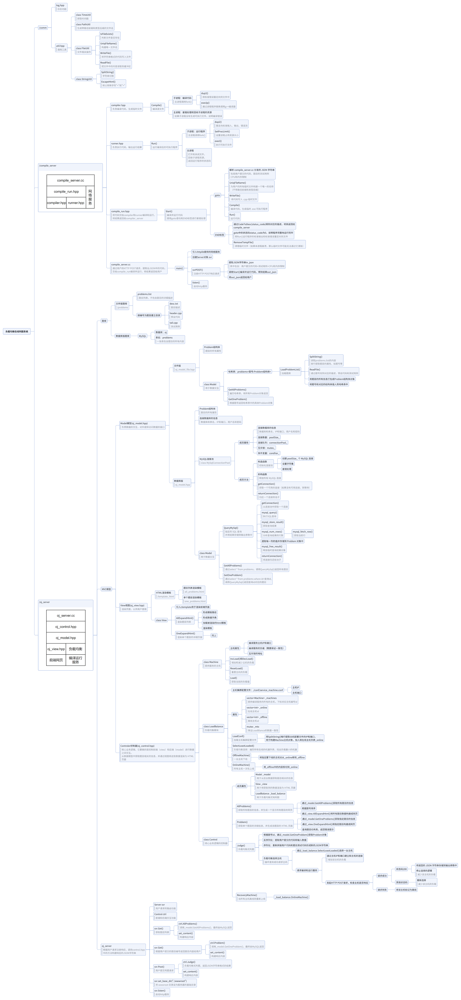

## 项目介绍

本项目是一个负载均衡的在线判题系统 (Online Judge, OJ) 的简易实现。该系统的核心功能是处理大量编程问题的提交，并通过负载均衡的机制，分配判题任务到多台服务器上，确保高效和可靠的评测。系统通过自动选择负载较低的服务器进行编译和运行用户提交的代码，监控服务器的状态，并在服务器无响应时自动切换到其他在线主机。

项目的核心是高效地调度和处理来自前端的代码提交请求，并将其发送到后端编译服务器进行处理，最后将结果返回给用户。主要难点包括负载均衡的实现、服务器状态监控、并发处理和任务失败的重试机制。

### 核心模块

项目核心模块：

- comm : 「公共模块」。提供日志、时间戳获取、路径拼接、文件操作、字符串处理、网络请求等功能。
- compile_server : 「编译与运行服务模块」。让用户提交的代码与测试用例拼接后在服务器上编译并运行，将结果返回给用户。
- oj_server : 「核心控制模块」。后端连接 MySQL 或读取文件，注册 HTTP 请求的响应，向用户提供可以浏览题目和提交代码的前端页面，或者提供负载均衡的编译与运行服务。

本项目只实现在线判题系统的最基本的几个功能：

- 向用户展示题目及可提交代码的前端页面
- 后端提供负载均衡式的编译与运行服务
- 向用户展示代码编译或运行的结果

简单介绍一下为什么要用负载均衡算法。我们通过 OJ 平台享受判题服务，这是基于 B/S 结构（Browser/Server）的，最基本的结构是多个浏览器请求一个服务器的服务，随着浏览器的增多，服务器也要随之增加。

在线判题（OJ）平台需要处理大量用户同时提交的代码请求，负载均衡算法能够有效分配这些请求到不同的服务器，防止某些服务器过载。通过负载均衡，可以优化系统的资源利用率，提高请求处理速度，减少响应时间，确保系统的高可用性和稳定性，特别是在用户并发量较大的情况下，负载均衡还能避免单点故障，提升整体性能和用户体验。

### 项目结构


思维导图：



项目地址：

- [github](https://github.com/shawyxy/load-balanced-online-judge-system)
- [gitee](https://gitee.com/shawyxy/load-balanced-online-judge-system)

## 技术栈及开发环境

### 技术栈

- C++ STL 标准库
- Boost 准标准库（字符串切割）
- cpp-httplib 第三方开源网络库
- ctemplate 第三方开源前端网页渲染库
- jsoncpp 第三方开源序列化、反序列化库
- 负载均衡算法设计
- 并发编程
- MVC 模型
- MySQL C connect（连接池）
- Ace 前端在线编辑器
- html/css/js/jquery/ajax

### 开发环境

- Centos 7.9 与 VSCode
  - 建议使用其他未被终止维护的 Linux 发行版本，否则你会浪费很多时间。
  - 云服务器内存至少 1G，因为 VSCode 的 code-server 很占内存。
  - 我的虚拟机配置：内存 4G，内存 2 处理器 2 核心。
- g++ 8.3.1
- MySQL 5.7
- MySQL Workbench

## 通用工具模块（/comm）

首先说明：下面的各种工具类不是在一开始就明确要写好哪些功能，只有一个大概的框架，它们是根据实时进度而完善的，不过这里为了文章的层次性，考虑到工具类的实现比较简单，并且不依赖其他功能的实现，所以这里把所有的工具类的实现先给出来，后面看到再上来查，可以先不用细看。

### 日志工具类（log.hpp）

作为 OJ 系统的日志，除了必要的日志等级，时间等信息之外，为了快速定位错误，还要有文件名，出错位置所在的行号。

1. 日志等级：通常用枚举类型定义常量。
2. 时间戳：通过 comm::GetTimeStamp() 获取。
3. 文件名：通过宏 `__FILE__` 获得。
4. 行号：通过宏 `__LINE__` 获得。

宏 `__FILE__` 和 `__LINE__` 可以返回它所在的文件名和行号，例如：

```cpp
//ac.cpp
#include <iostream>
using namespace std;
int main()
{
    cout<< __FILE__ << " " << __LINE__ << endl;
    return 0;
}
```

输出：

````
ac.cpp 5
````

---

下面的 Log() 函数就是拼接字符串到流对象中，然后返回。因为它经常被调用，所以设置为内联函数，并且定义为宏，方便使用。

日志信息主要用于开发人员调试，像服务器后台程序崩溃等信息，用户没有知晓的必要，只需要向用户展示有关该题目评测的信息。

```cpp
#pragma once

#include <iostream>
#include <string>
#include "util.hpp"

namespace ns_log
{
    using namespace ns_util;
    // 日志等级
    enum
    {
        INFO,    // 常规信息
        DEBUG,   // 调试信息
        WARNING, // 告警信息
        ERROR,   // 错误信息
        FATAL,   // 严重错误信息
    };
    // 返回值：[日志等级][文件名][行号]
    inline std::ostream &Log(const std::string level, const std::string file_name, int line)
    {
        // 添加日志等级
        std::string msg = "[";
        msg += level;
        msg += "]";
        // 添加报错文件名称
        msg += "[";
        msg += file_name;
        msg += "]";
        // 添加报错行
        msg += "[";
        msg += std::to_string(line);
        msg += "]";
        // 日志时间戳
        msg += "[";
        msg += TimeUtil::GetTimeStamp();
        msg += "]";
        // 将 msg 加入到 cout 的缓冲区
        std::cout << msg;
        return std::cout;
    }
// 定义为宏
#define LOG(level) Log(#level, __FILE__, __LINE__)
}

```

细节：

1. 返回 `std::cout` 的引用，以支持链式输出（即在调用 `Log()` 后可以继续输出其他内容）。

2. 宏定义，用于简化日志函数的调用方式。
   - `#level`：在宏中使用 `#` 表示将 `level` 转换为字符串。例如，当传入 `INFO` 时，`#level` 会变成 `"INFO"`。

测试（注意要链接两个头文件编译生成的 `.o` 文件）：
```cpp
// test.cpp
#include "log.hpp"
using namespace ns_log;
int main()
{
    LOG(INFO) << "自定义内容 \ n";
    return 0;
}
```

输出：
```
[INFO][test.cpp][6][1728392770] 自定义内容
```

### 时间工具类（TimeUtil）

在上面使用到了 TimeUtil::GetTimeStamp()，下面通过 gettimeofday() 系统调用分别返回秒级和毫秒级的时间戳。

```cpp
#pragma once

#include <iostream>
#include <string>
#include <sys/time.h>

namespace ns_util
{
    class TimeUtil
    {
    public:
        // 获得秒级时间戳
        static std::string GetTimeStamp()
        {
            struct timeval tv;
            gettimeofday(&tv, nullptr);
            return std::to_string(tv.tv_sec);
        }
        // 获得毫秒级时间戳
        static std::string GetTimeMs()
        {
            struct timeval tv;
            gettimeofday(&tv, nullptr);
            return std::to_string(tv.tv_sec * 1000 + tv.tv_usec / 1000);
        }
    };
}
```

使用 `struct timeval` 结构体来存储时间。`timeval` 是一个标准的 C 语言结构体，包含两个成员：

- `tv_sec`：自 Unix 纪元（1970-01-01 00:00:00 UTC）以来的秒数。
- `tv_usec`：微秒数（即秒的小数部分，单位是微秒）。

这个时间工具类在文件的命名时还会被使用到，因为 OJ 平台可能一秒钟之内有大量的用户提交文件，所以服务端接收到文件后要唯一地标识它，通过更细粒度的毫秒级时间戳实现。

### 建名工具类（PathUtil）

首先考虑编译一个源文件，对于编译器来说它需要源文件的路径，并且需要源文件的后缀为 “.cpp”。

除了源文件之外，编译链接后产生的可执行文件，可以用后缀 “.exe” 表示。

由于可能出现编译错误，那么编译错误时编译器输出的错误信息也应该写入一个文件，用后缀 “.compile_error” 表示。

当成功生成可执行程序后，OJ 通常需要输入用例和输出答案，程序运行时也可能发生错误（如除零错误或整数 / 小数溢出等运行时错误）。以上分别默认属于标准输入（用例），标准输出（答案）和标准错误，我们需要用 **重定向** 把数据保存在文件中作为可执行程序的标准输入，或者将数据或信息输出到文件中。

```cpp
// 路径前缀，用于临时存放编译生成的文件
static const std::string temp_path = "./temp/";

// 建名工具类
class PathUtil
{
public:
    // 路径前缀 + 文件名 + 后缀
    // 文件名：test -> 构建后：./temp/test.cpp
    static std::string AddSuffix(const std::string &file_name, const std::string &suffix)
    {
        std::string path_name = temp_path;
        path_name += file_name;
        path_name += suffix;
        return path_name;
    }
    // C++ 源文件
    static std::string Src(const std::string &file_name)
    {
        return AddSuffix(file_name, ".cpp");
    }
    // 可执行程序文件
    static std::string Exe(const std::string &file_name)
    {
        return AddSuffix(file_name, ".exe");
    }
    // 编译错误文件
    static std::string CompilerError(const std::string &file_name)
    {
        return AddSuffix(file_name, ".compile_error");
    }
    // 重定向：作为可执行程序的标准输入（本来由键盘输入）
    static std::string Stdin(const std::string &file_name)
    {
        return AddSuffix(file_name, ".stdin");
    }
    // 重定向：将可执行程序的标准输出重定向到文件（本来输出到屏幕）
    static std::string Stdout(const std::string &file_name)
    {
        return AddSuffix(file_name, ".stdout");
    }
    // 重定向：用于接收可执行程序的标准错误信息（本来输出到标准错误）
    static std::string Stderr(const std::string &file_name)
    {
        return AddSuffix(file_name, ".stderr");
    }
};
```

由于编译可能成功也可能失败，会对应产生可执行程序，输出结果以及错误信息，这些信息要么是标准输入，要么是标准输出和标准错误，它们需要被保存在临时文件中，临时文件的路径被定义为 `./temp/`。

这样 compiler 模块产生的可执行程序等文件就可以被 runner 模块获取并执行了。

### 文件工具类（FileUtil）

```cpp
#include <fstream>
#include <atomic>
// 文件工具类
class FileUtil
{
public:
    // 判断文件是否存在
    static bool IsFileExists(const std::string &path_name)
    {
        struct stat st;
        if (stat(path_name.c_str(), &st) == 0)
        {
            // 获取属性成功，文件已经存在
            return true;
        }
        return false;
    }

    // 构建唯一文件名（不包含路径和后缀，只由编号和时间戳组成）
    static std::string UniqFileName()
    {
        static std::atomic_uint id(0);
        id++; // 原子计数器
        // 毫秒级时间戳 + 原子性递增唯一值: 来保证唯一性
        std::string ms = TimeUtil::GetTimeMs(); // 毫秒级时间戳
        std::string uniq_id = std::to_string(id); // 唯一 id
        return ms + "_" + uniq_id;
    }

    // 将字符串格式的代码写入文件
    // 参数：
    //     target：被写入的文件名
    //     content：字符串格式的代码
    // 返回值：是否写入成功
    static bool WriteFile(const std::string &target, const std::string &content)
    {
        std::ofstream out(target);
        if (!out.is_open()) // 打开文件失败
        {
            return false;
        }
        out.write(content.c_str(), content.size()); // 写入文件
        out.close();
        return true;
    }

    // 把文件中的内容读取到缓冲区
    // 参数：
    //     target：被读取的文件名
    //     content：输出型参数，用于保存读取的内容
    //     keep：是否保留行尾的换行符'\n'
    // 返回值：是否读取成功
    static bool ReadFile(const std::string &target, std::string *content, bool keep = false)
    {
        (*content).clear(); // 清空缓冲区

        std::ifstream in(target);
        if (!in.is_open()) // 打开文件失败
        {
            return false;
        }
        std::string line;
        // getline 不会读取换行符'\n'
        while (std::getline(in, line))
        {
            (*content) += line;
            (*content) += (keep ? "\n" : ""); // 手动添加换行符'\n'
        }
        in.close();
        return true;
    }
```

### 字符串工具类（StringUtil）

实现了一个字符串切割函数，它需要用到 Boost 库，CentOS 7 安装：

```
sudo yum install boost boost-devel
```

然后包含头文件：`<boost/algorithm/string.hpp>`

```cpp
class StringUtil
{
public:
    // 字符串切割
    // 参数：
    //     str：要被切割的目标字符串
    //     target：输出型参数，用于保存切割后的字串
    //     sep：指定的分隔符
    static void SplitString(const std::string &str, std::vector<std::string> *target, const std::string &sep)
    {
        boost::split((*target), str, boost::is_any_of(sep), boost::algorithm::token_compress_on);
    }
};
```

其中 `token_compress_on` 表示不论有多少个连续的分隔符，都把它看作一个，只切割一次，只有一个换行符。否则有多少个分隔符，切割后就有多少个换行符。

## CompileServer 编译运行模块（/compile_server）

`CompileServer` 模块负责编译用户提交的代码，如果没有编译错误，则运行该程序，用准备好的测试用例进行测试，最后返回结果给用户。

`CompileServer` （compile_server.cc）模块分为两部分：

- `Compiler` 模块（compiler.hpp）：**专门负责编译源代码**。
- `Runner` 模块（runner.hpp）：**专门负责运行程序**。


编译源文件的流程：

1. 接收用户从远端提交的代码（compile_server.cc）
2. 把字符串格式的代码提取并写入到临时源文件中，用唯一的名字标识它（compile_run.hpp）
3. 编译源文件（compiler.hpp）
   1. 编译失败：将错误信息重定向到文件中
   2. 编译成功则运行（runner.hpp），将运行的结果重定向到文件中
4. 向用户返回重定向文件中的信息（compile_server.cc）

将 `Compiler` 和 `Runner` 模块分离是为了提高 OJ 系统的安全性、资源管理、系统性能、并发处理能力，并且增强系统的可维护性与扩展性：

- 安全性
     - 编译和运行的分离能够提高安全性。编译源代码的过程相对安全，因为它只是将代码翻译成可执行的二进制文件。然而，运行用户提交的程序存在风险，尤其是恶意或错误的代码，可能导致无限循环、内存泄漏、资源滥用甚至系统崩溃。


- 资源隔离与管理
     - 编译和运行程序的资源需求不同。编译阶段通常只需要 CPU 资源，而运行阶段可能还需要额外的内存、网络或文件 I/O 等资源。


- 提高系统效率

     - 在线评测系统通常会处理大量并发的用户提交，将编译和运行解耦，可以实现并发优化。不同的代码编译时间和运行时间可能相差很大，分开处理能够提高整体系统的吞吐量。

     - 例如，可以先并发编译多个用户的代码，然后将编译好的代码交给 Runner 模块并发执行，避免让编译和运行相互阻塞。


- 支持多语言编译和运行

     - 不同编程语言的编译过程差异很大，某些语言可能不需要编译（如 Python）。通过分离编译和运行模块，可以更容易地支持多种编程语言。

     - 例如，对于 C++，Compiler 模块使用 g++ 进行编译，而 Runner 模块负责运行编译生成的二进制文件；对于 Python，只需要在 Runner 模块中解释运行源代码文件。


### Compiler 编译模块（compiler.hpp）

compiler 要做的就是编译，在此之前已经创建了具有唯一标识的源代码文件。它利用了进程创建和文件操作功能来实现编译功能。关键步骤包括：

- 父进程用于差错处理，如判断编译是否成功；子进程完成实际的编译工作（`fork`）
- 子进程中使用 ** 进程程序替换 ** 系统调用，调用编译器进行编译（`execlp`）
  - 设置 `umask(0)` 以确保创建的文件有正确的权限。如果不设置 `umask(0)`，系统可能会自动屏蔽掉某些权限（如 `022` 可能导致文件权限变为 `rw-r--r--`）。
  - 使用 `open` 打开一个用于保存编译错误的 `.compile_error` 文件（如果没有则创建，可读可写：`O_CREAT | O_WRONLY`）。` 临时路径 + 文件名. compile_error` 由 `PathUtil::CompilerError` 构造。
  - 使用 `dup2` 重定向标准错误输出（文件描述符号是 2）到打开的文件 `_stderr`，以便捕获编译期间产生的错误。
  - 调用 `execlp`，使用 `g++` 编译程序：将文件编译为可执行文件（`-o` 参数指定输出文件名）。这里编译的源代码文件是通过 `PathUtil` 获取的文件路径。
- 父进程等待子进程结束（`waitpid`）

```cpp
#pragma once

#include <iostream>
#include <unistd.h>
#include <wait.h>
#include <sys/types.h>
#include <fcntl.h>

#include "../comm/util.hpp"
#include "../comm/log.hpp"

namespace ns_compiler
{
    // 引入路径拼接和日志功能
    using namespace ns_util;
    using namespace ns_log;

    class Compiler
    {
        Compiler() {}
        ~Compiler() {}
        // 编译源文件
        // 参数：不带路径前缀和类型后缀的文件名
        // 返回值：编译成功与否
        static bool Compile(const std::string &file_name)
        {
            pid_t pid = fork();
            if (pid < 0) // 创建子进程失败
            {
                LOG(ERROR) << "内部错误：创建子进程失败 \ n";
                return false;
            }
            else if (pid == 0) // 子进程
            {
                umask(0); // 确保系统不会屏蔽文件权限
                // 打开 / 新建文件，用于保存输出到标准错误的内容，返回值是文件描述符
                // 构造完整的带路径和类型后缀的文件名
                int cperr_fd = open(PathUtil::CompilerError(file_name).c_str(), O_CREAT | O_WRONLY, 0644); // <fcntl.h>
                if (cperr_fd < 0)                                                                          // 打开或创建文件失败
                {
                    LOG(WARNING) << "打开或创建 .compile_error 文件失败 \ n";
                    exit(1);
                }

                // 将标准错误（2）重定向到 .compile_error 文件（cperr_fd）
                dup2(cperr_fd, 2);

                // 进程程序替换：调用 g++ 编译器
                // 相当于：g++ -o file_name.exe file_name.cpp -std=c++11
                execlp("g++", "g++", "-o", PathUtil::Exe(file_name).c_str() /*.exe*/,
                       PathUtil::Src(file_name).c_str() /*.cpp*/, "-std=c++11", nullptr /* 选项终止处 */);
                // 如果 execlp 执行成功，是不会走到这里的，而是执行完 g++ 后终止
                LOG(ERROR) << "启动编译器 g++ 失败，可能是参数错误 \ n";
                exit(2);
            }
            else // 父进程回收子进程资源
            {
                waitpid(pid, nullptr, 0);
                // 如果 g++ 编译成功，则会生成. exe 文件，如果没有生成，则说明编译失败
                if (FileUtil::IsFileExists(PathUtil::Exe(file_name)))
                {
                    LOG(INFO) << PathUtil::Src(file_name) << "编译成功 \ n";
                    return true;
                }
                LOG(ERROR) << "编译失败，没有生成可执行程序 \ n";
                return false;
            }
        }
    };
}
```

值得注意的是：

1. **进程程序替换就是让子进程通过特定的接口（exec 函数），加载磁盘上的一个全新的程序（代码和数据），加载到调用进程的进程地址空间中**。子进程执行不同的程序，叫做替换。

   它会用新的程序来 **完全替换 **当前进程的代码、数据和堆栈，而不会启动一个新进程。换句话说，**当前进程的代码会被替换为新的程序**，因此如果 `execlp` 执行成功，它不会返回，也就不会执行 `execlp` 之后的任何代码。

   > 子进程进行进程替换，有没有创建一个新的子进程？

   没有。进程 = 内核数据结构（PCB）+ 代码 + 数据，因为内核数据结构没有发生改变，所以没有创建新的进程。

2. 如果子进程退出，编译可能成功也可能失败，所以 waitpid 的第二个参数（status：指向一个 `int` 类型的指针，用于保存子进程的退出状态）设置为 `nullptr`，在子进程结束后再分别处理两种尝试编译的结果。
3. 只有打开文件获取文件描述符以后才可以用 dup2 重定向，所以打开或创建文件失败，就直接 exit 退出。`dup2(new_fd，old_fd)`。

### Runner 运行模块（runner.hpp）

运行模块要考虑的东西比编译模块多一些，因为运行时会出现各种异常，会产生各种文件，因此返回值应该是一个错误码，这个错误码会被 compile_run.hpp 调用 runner.hpp 后接收，然后再根据错误码去查表，找到对应的错误原因，返回给用户。

不过对于 Runner 模块，**它只关心运行这件事**，而不关心运行的结果正确与否或运行时发生的错误，它只需要运行它，把运行结束或被终止的状态码返回给 compile_run.hpp，再由 compile_run.hpp 来判断结果正确与否或者差错处理，因为测试用例是 compile_run.hpp 给的，它是 Compiler 模块和 Runner 模块的协调者，这样就把编译，运行，验证答案和差错处理这三个大流程解藕出来了。

#### 资源约束（Runner::SetProcLimit()）

在这里我们只关心时间和空间的限制，对非法内存空间访问等安全性限制暂不做要求。

系统调用 `setrlimit` 可以限制当前进程的 CPU 使用时间和内存使用量：

```c
int setrlimit(int resource, const struct rlimit *rlim);
```

- `resource`: 要设置的资源类型，如 CPU 时间、内存大小等。
- `rlim`: 指向一个 `rlimit` 结构的指针，设置该资源的限制。

其中，`struct rlimit`：

```c
struct rlimit {
    rlim_t rlim_cur;  // 软限制
    rlim_t rlim_max;  // 硬限制
};
```

- `rlim_cur`：进程可以使用的资源的当前限制（软限制）。
- `rlim_max`：资源的最大限制（硬限制），只能由超级用户（root）增大。我们不作设置（`RLIM_INFINITY`，值为 - 1）

设置 CPU 时间：`RLIMIT_CPU`：指定该进程可以使用的 CPU 时间（以秒为单位）。超出限制后，内核会向该进程发送 `SIGXCPU` 信号（6 号），最终导致进程终止。

设置内存限制：`RLIMIT_AS`：指定进程的虚拟地址空间（即允许的内存大小）。当进程超出该限制时，内核会向进程发送 `SIGSEGV` 信号（24 号），导致内存不足错误。

```cpp
#pragma once

#include <iostream>
#include <sys/resource.h>
#include <unistd.h>
#include <sys/types.h>
#include <sys/stat.h>

#include "../comm/util.hpp"
#include "../comm/log.hpp"

namespace ns_runner
{
    // 引入路径拼接和日志功能
    using namespace ns_util;
    using namespace ns_log;
    class Runner
    {
    public:
        Runner() {}
        ~Runner() {}

    public:
        // 提供设置进程占用资源大小的接口
        static void SetProcLimit(int _cpu_limit, int _mem_limit)
        {
            // 设置 CPU 时间限制（秒）
            struct rlimit cpu_rlimit;
            cpu_rlimit.rlim_max = RLIM_INFINITY;
            cpu_rlimit.rlim_cur = _cpu_limit;
            setrlimit(RLIMIT_CPU, &cpu_rlimit);

            // 设置内存限制（KB）
            struct rlimit mem_rlimit;
            mem_rlimit.rlim_max = RLIM_INFINITY;
            mem_rlimit.rlim_cur = _mem_limit * 1024; // 转化成为 KB
            setrlimit(RLIMIT_AS, &mem_rlimit);
        }
        static int Run(const std::string &file_name, int cpu_limit, int mem_limit)
        {
         	// ...
        }
    };
}
```

实际上内存限制不会很严格，因为它限制的是整个程序占用的内存（这也是有些 OJ 题空间限制不是很严格的时候，能卡过去的原因之一），关于资源是如何被限制的，请看下面的代码。

#### 程序运行（Runner::Run()）

因为运行时可能会出现各种各样的错误，所以运行函数（Run()）的返回值应该是一个标识状态的整数，作为一个在 OJ 平台运行的程序，总共有三大种状态：

1. 运行结束
   - 结果错误
   - 结果正确
2. 运行被终止

对于运行结束的两种情况，Run() 不需要关心，而对于运行被终止的情况，操作系统是通过信号终止程序运行的，就像上面 `setrlimit` 返回 6 号和 24 号状态码一样。

下面是运行可执行程序（它被 compiler 模块编译在 `./temp/` 路径下）的流程：

1. 构建 [标准输入，标准输出，标准错误] 重定向的文件和可执行程序文件的文件名，它包含完整的路径和后缀。需要使用 `PathUtil` 中的函数构建。
2. 打开 [标准输入，标准输出，标准错误] 重定向的文件，如果不存在则创建，默认文件拥有者具有执行权限。
   - 只有打开文件获取文件描述符以后才可以用 dup2 重定向，所以一旦打开文件或创建文件失败，就直接退出运行的逻辑。这里我们就不用 exit 了，而直接返回一个负整数表示自定义的状态码，因为正整数的状态码被操作系统使用了。
3. 用子进程运行程序
   - 如果创建子进程失败，则关闭刚才打开的文件描述符。
   - 在子进程中用 `dup2` 重定向标准输入，标准输出和标准错误，并调用上面实现的进程资源约束的 `SetProcLimit()`，然后使用 `execl` 系统调用实现进程程序替换。
     - 如果 `execl` 执行成功，子进程将不会再执行当前代码的后续部分。
     - 如果 `execl` 执行失败，子进程将退出，父进程接收到相应状态。
4. 子进程运行程序完毕：
   - 关闭打开的文件描述符。
   - 父进程调用 `waitpid` 来等待子进程结束，并通过 `status` 检查子进程的终止状态（这是和 compiler 不一样的地方，因为我们需要知道子进程是为什么被终止的）。
   - `status & 0x7F`：检查子进程是否因为收到信号终止。低 7 位保存的是导致进程终止的信号编号。

下面是导致进程终止的信号编号：


至于自定义的内部编号（负整数），会在 compile_run.hpp 调用 compiler.hpp 和 runner.hpp 时定义编号对应的描述。

```cpp
#include <unistd.h>
#include <wait.h>
#include <fcntl.h>


// 运行编译后的可执行程序，并通过设置资源限制和重定向标准输入、输出、错误流来控制进程。
// 参数：
//     file_name：需要运行的文件名（同源文件），不带路径前缀和类型后缀
//     cpu_limit：设置 CPU 时间限制（秒）
//     mem_limit：设置内存限制（KB）
// 返回值：
//     > 0：表示程序异常终止，值为信号编号。
//     == 0：表示程序正常运行结束，输出结果被写入到指定的标准输出文件中。
//     < 0：表示内部错误，比如无法创建子进程或打开文件失败。
static int Run(const std::string &file_name, int cpu_limit, int mem_limit)
{

    std::string _execute = PathUtil::Exe(file_name);
    std::string _stdin = PathUtil::Stdin(file_name);
    std::string _stdout = PathUtil::Stdout(file_name);
    std::string _stderr = PathUtil::Stderr(file_name);

    umask(0);
    // 打开输入 / 输出 / 错误文件，这些文件描述符用于重定向进程的标准输入、输出和错误流。
    int _stdin_fd = open(_stdin.c_str(), O_CREAT | O_RDONLY, 0644);
    int _stdout_fd = open(_stdout.c_str(), O_CREAT | O_WRONLY, 0644);
    int _stderr_fd = open(_stderr.c_str(), O_CREAT | O_WRONLY, 0644);

    if (_stdin_fd < 0 || _stdout_fd < 0 || _stderr_fd < 0)
    {
        LOG(ERROR) << "运行时打开标准文件失败 \ n";
        return -1; // 代表打开文件失败
    }
    // 创建子进程
    pid_t pid = fork();
    if (pid < 0)
    {
        LOG(ERROR) << "运行时创建子进程失败 \ n";
        close(_stdin_fd);
        close(_stdout_fd);
        close(_stderr_fd);
        return -2; // 代表创建子进程失败
    }
    else if (pid == 0)
    {
        // 重定向标准输入、输出、错误流
        dup2(_stdin_fd, 0);
        dup2(_stdout_fd, 1);
        dup2(_stderr_fd, 2);
        // 设置资源限制
        SetProcLimit(cpu_limit, mem_limit);
        // 执行可执行文件
        execl(_execute.c_str(), _execute.c_str(), nullptr);
        // 如果 execl 正常调用，不会执行下面的内容
        exit(1);
    }
    else
    {
        close(_stdin_fd);
        close(_stdout_fd);
        close(_stderr_fd);
        int status = 0;
        // 父进程等待子进程结束
        waitpid(pid, &status, 0);
        // 程序正常运行到结束，status 为 0，否则不为 0
        LOG(INFO) << "运行完毕，status：" << (status & 0x7F) << "\n";
        return status & 0x7F;
    }
}
```

细节：为什么这里用 `execl` 而不像 compiler 模块一样用 `execlp`？

原因：运行文件时，已经明确知道可执行文件的路径（被 compiler 模块编译在 `./temp/` 路径下），该文件路径是通过 `PathUtil::Exe(file_name)` 得到的，因此，`_execute` 是一个明确的文件路径。使用 `execl` 是直接执行该路径下的文件，这比依赖 `PATH` 环境变量查找的 `execlp` 更可靠。

### compile_run 模块（compile_run.hpp）


compile_run.hpp 是 compile_server.cc 和编译模块以及运行模块的中间层，compile_run.hpp 接收来自 compile_server.cc 下发的 json 字符串，它包含用户提交的代码（code）和测试用例（input）。

#### JSON

> 网络传输中的数据经常使用 **JSON (JavaScript Object Notation)** 格式，因为它很轻量，使用简单的键值对来表示数据，这意味着它不仅可读性好，开销也更低。几乎所有主流编程语言都有内置或第三方库来支持 JSON 的序列化和反序列化操作。这使得 JSON 成为不同平台或系统之间进行数据交换的理想选择。

要在 C++ 中使用 json，首先需要安装 jsoncpp 库（CentOS 7）：

```bash
sudo yum install jsoncpp-devel -y
```

如果你的源没有（我的是阿里源）：

```
No package jsoncpp-devel available.
```

那么可以先安装 epel 源

```bash
sudo yum install epel-release
```

下面是一个测试：

```cpp
// 这个头文件是 JsonCpp 库的一部分，用来处理 JSON 数据
#include <jsoncpp/json/json.h>
#include <iostream>
#include <string>
int main()
{
    // Json::Value 是 JsonCpp 提供的一个类，表示一个 JSON 值
    Json::Value root;
    // 这样的操作会自动为 JSON 对象添加新的键值对。
    root["code"] = "#include <iostream> int main(){}";
    root["input"] = "1 2 3 4";
    root["author"] = "xy";
    root["time"] = "2024/10";
    // 用于将 JSON 对象转换为格式化的 JSON 字符串。
    Json::StyledWriter writer;
    // 将 root 对象转换为 JSON 字符串
    std::string str = writer.write(root);
    std::cout << str << std::endl;
    return 0;
}
```

编译需要链接 jsoncpp 库：

```bash
g++ test.cpp -std=c++11 -ljsoncpp
```

输出：

```
{
   "author" : "xy",
   "code" : "#include <iostream> int main(){}",
   "input" : "1 2 3 4",
   "time" : "2024/10"
}
```

#### 编译并运行（CompileAndRun::Start()）

`Start` 函数的主要功能是从 JSON 格式输入解析代码、编译并运行程序，处理执行过程中的错误，并将结果返回为 JSON 格式输出。将输出型参数作为返回值，由上层的 compile_server.cc 接收。

compile_server.cc 接收到远端用户发送的代码 code，并将在本地的测试用例作为 input，以及题目要求的 CPU 和内存限制，一并以键值对的形式存入 JSON 对象中，作为参数传给 CompileAndRun::Start()。

下面是 `Start` 函数的流程：

1. 解析输入的 JSON 格式字符串：
   - `code`: 代码内容
   - `input`: 运行代码时的输入
   - `cpu_limit`: CPU 使用限制
   - `mem_limit`: 内存使用限制
2. 初步验证与临时文件生成
   - 检查代码是否为空。如果为空，则设置 `status_code = -1` 并结束流程。
   - 生成唯一的临时文件名，确保文件名的唯一性（避免冲突），需要使用 `FileUtil::UniqFileName()`。
3. 将代码写入临时文件并编译（`FileUtil::WriteFile()`）
   - 将代码内容写入临时源文件中。如果写入失败，返回状态码 `-2`。
   - 使用编译器对源代码进行编译。如果编译失败，返回状态码 `-3`。
4. 运行编译后的程序
   - 使用 `Runner::Run` 函数运行编译后的程序，并设置 CPU 和内存的限制。
   - 如果运行失败，状态码根据不同的运行结果设置：
     - `run_result < 0`: 运行失败，未知错误，状态码 `-2`。
     - `run_result > 0`: 程序异常结束，状态码为信号值。
     - `run_result == 0`: 程序运行成功，状态码 `0`。
5. 返回结果并处理输出
   - 根据运行状态设置状态码 `status` 和对应的描述 `reason`。
   - 如果程序运行成功，读取并返回程序的标准输出和标准错误（`FileUtil::ReadFile()`）。
6. 序列化输出：将结果 `out_value` 转换成 JSON 字符串，输出给 `out_json`。
7. 临时文件清理

其中，错误处理的逻辑通过 `goto END` 跳转机制简化了代码逻辑，使得异常处理较为集中，差错处理的可以在实现 `CodeToDesc()` 时再来看。

```cpp
#pragma once

#include <jsoncpp/json/json.h>

#include "../comm/log.hpp"
#include "../comm/util.hpp"
#include "compiler.hpp"
#include "runner.hpp"

namespace ns_compile_run
{
    // 引入路径拼接和日志功能
    using namespace ns_util;
    using namespace ns_log;
    // 引入编译和运行模块
    using namespace ns_compiler;
    using namespace ns_runner;

    class CompileAndRun
    {
    public:
        CompileAndRun() {}
        ~CompileAndRun() {}

    public:
        static void RemoveTempFile(const std::string &file_name) {}
        static std::string CodeToDesc(int code, const std::string &file_name)
        {
            std::string desc;
            // ...
            return desc;
        }
        // 解析 compile_server.cc 分发的 JSON 字符串，编译并运行代码
        // 输入参数：
        //     in_json：{
        //         "code": "用户提交的代码",
        //         "input": "题目对应的测试用例",
        //         "cpu_limit": CPU 时间限制,
        //         "mem_limit": 内存空间限制}
        // 输出参数（返回值）：
        //     out_json：{
        //  [必选] "status":"状态码",
        //  [必选] "reason":"状态码对应的描述",
        //  [可选] "stdout":"程序运行的标准输出",
        //  [可选] "stderr":"程序运行的标准错误",}
        static void Start(const std::string &in_json, std::string *out_json)
        {
            Json::Value in_value;
            Json::Reader reader;
            reader.parse(in_json, in_value); // 将 JSON 字符串转化为 JSON 对象，以便用 key 值

            std::string code = in_value["code"].asCString();
            std::string input = in_value["input"].asString();
            int cpu_limit = in_value["cpu_limit"].asInt();
            int mem_limit = in_value["mem_limit"].asInt();

            int status_code = 0;   // 返回的状态码默认为 0（一切正常）
            int run_status = 0;    // 运行后的状态码
            std::string file_name; // 唯一文件名
            Json::Value out_value; // 构建输出 JSON 对象

            // goto...END 之间定义变量可能会被忽略

            if (code.size() == 0)
            {
                status_code = -1; // 代码为空
                goto END;
            }
            // 为用户的所有临时文件构建一个唯一的名称（不带路径前缀和类型后缀）
            file_name = FileUtil::UniqFileName();

            // 将代码写入 .cpp 临时文件
            if (!FileUtil::WriteFile(PathUtil::Src(file_name), code))
            {
                status_code = -2; // 未知错误
                goto END;
            }

            // 编译代码
            if (!Compiler::Compile(file_name))
            {
                status_code = -3; // 编译失败
                goto END;
            }

            // 运行代码，设置时空限制，返回值是运行时 / 运行后的状态码
            run_status = Runner::Run(file_name, cpu_limit, mem_limit);
            if (run_status < 0)
            {
                status_code = -2; // 未知内部错误（由 Run 自定义）
            }
            else if (run_status> 0) // 系统信号中断
            {
                status_code = run_status;
            }
            else // 正常运行
            {
                status_code = 0;
            }

        END:
            out_value["status"] = status_code;                        // 返回状态码
            out_value["reason"] = CodeToDesc(status_code, file_name); // 返回状态码的描述
            // 程序完整地运行完毕
            if (status_code == 0)
            {
                // 运行程序的标准输出和标准错误的重定向文件都已经被 Runner::Run 创建
                // 路径：./temp/
                std::string _stdout;
                FileUtil::ReadFile(PathUtil::Stdout(file_name), &_stdout, true);
                out_value["stdout"] = _stdout;

                std::string _stderr;
                FileUtil::ReadFile(PathUtil::Stderr(file_name), &_stderr, true);
                out_value["stderr"] = _stderr;
            }
            Json::StyledWriter writer;
            *out_json = writer.write(out_value);
            // 清理临时文件
            RemoveTempFile(file_name);
        }
    };
}
```

#### CompileAndRun::CodeToDesc()

`CompileAndRun::CodeToDesc(code, file_name)` 用于返回 `code` 对应的状态描述，之所以有一个 `file_name` 参数，是因为发生编译错误时，需要 **向用户** 发送编译错误的具体信息，并且 `FileUtil::ReadFile()` 的第二个参数是输出型参数的原因也在于此，方便得到结果。

这里有个细节：还记得我们在 `Runner::Run()` 中也自定义了不少负整数的返回值吗？例如我们定义 - 1 表示打开文件失败，-2 表示创建子进程失败，这不是和 `CompileAndRun::Start()` 中定义的 - 1 和 - 2 等状态码冲突了吗？

首先我们要明确不同模块的层级，面向的对象是不同的，`CompileAndRun` 模块是被 compile_server.cc 调用，它是离用户更近的那一层，所以 `CompileAndRun` 应该返回和用户相关的信息，例如编译哪里出错了，运行成功还是失败了，结果如何等等。

`Compiler` 模块和 `Runner` 模块是底层模块，它们面向的是开发人员，所以这里面会打一些日志，当上层遇到 - 2（未知内部错误）时，开发人员去查日志就好了。

```cpp
// 返回状态码对应的描述
static std::string CodeToDesc(int code, const std::string &file_name)
{
    std::string desc;
    switch (code)
    {
    case 0:
        desc = "编译并运行成功";
        break;
    case -1:
        desc = "用户提交的代码为空";
        break;
    case -2:
        desc = "内部未知错误";
        break;
    case -3:
        // desc = "编译错误";
        FileUtil::ReadFile(PathUtil::CompilerError(file_name), &desc, true);
        break;
        break;
    case SIGABRT:
        desc = "内存超限";
        break;
    case SIGXCPU:
        desc = "CPU 超时";
        break;
    case SIGSEGV:
        desc = "段错误";
    case SIGFPE:
        desc = "算术错误（除零错误 / 浮点错误 / 溢出错误）";
        break;
    default:
        desc = "未知错误，code：" + std::to_string(code);
        break;
    }
    return desc;
}
```

#### CompileAndRun::RemoveTempFile()

这个 `RemoveTempFile` 函数用于清理在程序运行过程中生成的临时文件。

`file_name`: 生成的文件的唯一标识符，不包括路径和后缀。检查每个临时文件是否存在，如果存在则删除它们。`unlink`: Linux 系统调用，用于删除文件（相当于 `remove` 或 `delete` 操作）。

```cpp
// 清理临时文件
static void RemoveTempFile(const std::string &file_name)
{
    std::vector<std::string> files = {
        PathUtil::Src(file_name),
        PathUtil::CompilerError(file_name),
        PathUtil::Exe(file_name),
        PathUtil::Stdin(file_name),
        PathUtil::Stdout(file_name),
        PathUtil::Stderr(file_name)};

    for (const auto &file : files)
    {
        if (FileUtil::IsFileExists(file))
        {
            unlink(file.c_str());
        }
    }
}
```

### compile_server.cc 模块


#### 测试

我们已经实现了 compile_server.cc 下面的三个小模块，现在就差网络模块了，不过在此之前，先测试一下它们的功能是否正常。

首先介绍一下 C++ 中的原始字符串字面量（raw string literal） `R"()"` 。这种字符串字面量允许程序员在字符串中包含许多特殊字符而不需要进行转义，这在处理包含引号、反斜杠等字符的字符串时特别有用。

```cpp
#include "compile_run.hpp"
using namespace ns_compile_run;

int main()
{
    std::string in_json;
    Json::Value in_value;
    in_value["code"] = R"(
    #include<iostream>
    using namespace std;
    int main(){
        // int a;
        cin >> a;
        cout << a << endl;
        return 0;
    })";
    in_value["input"] = "1";
    in_value["cpu_limit"] = 1;
    in_value["mem_limit"] = 102400;

    // FastWriter 构建原始字符串（无 JSON 格式），用于网络传输
    Json::FastWriter writer;
    in_json = writer.write(in_value);
    std::cout << "原始字符串：\n" << in_json << std::endl;

    // StyledWriter 构建 JSON 格式字符串
    std::string out_json;
    // 编译并运行
    CompileAndRun::Start(in_json, &out_json);
    std::cout << "JSON 字符串：\n" << out_json << std::endl;

    return 0;
}
```

注意定义变量 a 的语句被注释掉了，那么编译会报错。

它的本质是添加了转移符的字符串（下面是 VSCode 中光标悬停在字符串上的提示）。


makefile：

```makefile
compile_server:compile_server.cc
	g++ -o $@ $^ -std=c++11 -ljsoncpp
.PHONY:clean
clean:
	rm -f compile_server
```

我们可以先把清除文件的 `RemoveTempFile` 注释掉，看看到底有没有生成临时文件，临时文件中的内容是什么样子的。在此之前你必须手动创建 `./temp/`。

make 并运行：


会发现只生成了 `.compile_error` 和 `.cpp` 文件，并且错误码是 - 3，表示发生了编译错误。

现在把两个临时文件手动删除，并且取消定义变量 a 的语句的注释。


可以看看. cpp 文件中的内容


由于暂时没有测试用例，所以标准输入的重定向文件没有内容，输入为默认值，运行结束后的状态码也为 0，表示一切正常。类似地，可以测试程序 CPU 和内存限制功能等其他功能是否正常。

编译错误（因申请过多内存）：


超时：


栈溢出：


算术错误：


#### 网络服务

万事俱备只欠东风，编译并运行的逻辑已经基本完善，下面要做的就是把这个编译并运行的功能打包，形成一个网络服务。

##### 安装 cpp-httplib 库

我们需要使用到一个开源的第三方网络库：`cpp-httplib`（建议 0.7.15 版本）。由于这是一个 header-only 的库，所以你不需要安装库（库具有屏蔽代码实现的作用），只需要把这个 [仓库](https://portrait.gitee.com/yuanfeng1897/cpp-httplib/tree/v0.7.15) 中的 `httplib.h` 下载下来，拷贝到 `/comm` 路径下。

##### 升级 g++

请注意，CentOS 7 的 gcc/g++ 版本默认是 4.8.5，需要升级 gcc/g++ 版本至少为 5 以上，否则会编译错误或运行错误。

```
NOTE:
g++ 4.8 and below cannot build this library since <regex> in the versions are broken.
```

教程：

1. [CentOS 7 升级 gcc/G++ 版本](https://blog.csdn.net/yetyongjin/article/details/134178420)
2. [Centos7 停止维护之后 升级 gcc|| 找不到 devtoolset-8-gcc* 问题解决方案](https://www.cnblogs.com/Jedi-Pz/p/18447117)

> 注意：如果你使用的是 CentOS 7，那么安装完 centos-release-scl 后，由于官方在 2024 年 7 月起停止维护 CentOS 7，所以 SCL 对应的源失效了，因此你再用 yum 指令就会报错（资源找不到）。
>
> 这时你按照第二个的教程替换两个文件的内容就好了。

查看版本：g++ -v：

```
gcc version 8.3.1 20190311 (Red Hat 8.3.1-3) (GCC)
```

确保每次启动新终端时都自动启用新版 g++，否则重启会话设置失效：

```bash
echo 'source /opt/rh/devtoolset-9/enable' >> ~/.bash_profile
```

##### 测试

`cpp-httplib` 是一个阻塞式的网络库，是因为它使用了系统的线程库，所以编译需要加 `-lpthread` 选项链接原生线程库（makefile 中改）。

在 [cpp-httplib 项目](https://portrait.gitee.com/yuanfeng1897/cpp-httplib/tree/v0.7.15#cpp-httplib) 的文档中有例子和教程，下面用一个简单的例子解释 `cpp-httplib` 的使用方法。

```cpp
#include "compile_run.hpp"
#include "../comm/httplib.h"

// 引入编译并运行模块
using namespace ns_compile_run;
// 引入网络服务模块
using namespace httplib;

int main()
{
    // 1. 创建 server 对象
    Server svr;
    // 2. 注册响应内容
    //    当用户请求 "/hello" 时，执行对应的响应（lambda 表达式）
    svr.Get("/hello", [](const Request &req, Response &resp)
            {resp.set_content("hello httplib", "text/plain;charset=utf-8;"); });
    // 3. 启动 http 服务
    svr.listen("0.0.0.0", 8080);
    return 0;
}
```

创建一个简单的 HTTP 服务器：

1. 创建一个 `Server` 对象 `svr`，这个对象就是 HTTP 服务器。

2. 注册一个 GET 请求的处理函数，当用户访问 `/hello` 路径时，会触发这个处理函数。
   - Lambda 函数作为处理器，接受两个参数：
     - `Request &req`: 表示用户的 HTTP 请求。
     - `Response &resp`: 表示服务器的 HTTP 响应。
   - 通过 `resp.set_content()` 设置响应内容为 `"hello httplib"`，并指定了 MIME 类型为 `"text/plain;charset=utf-8;"`，确保返回内容支持 UTF-8 编码的中文字符。
3. 启动 http 服务：
   - `"0.0.0.0"` 表示服务器监听来自任何 IP 地址的请求。
   - `8080` 表示服务器监听的端口。

如果你编译不过去，可能是 VSCode（尤其）和新版本 g++ 编译太耗内存了，云服务器配置不高（虚拟机可能不会），你可以重新连接 VSCode 让它恢复初始占用不高的状态或者只用 xshell 连接。


但是一访问这个端口，服务器就会崩，原因是我们没有在访问时设置任何请求（GET），那么默认请求就是请求服务器可执行文件的根目录（`GET("/")`）


依照这个原理，lambda 表达式中的 `req` 就是用户提交的代码，在表达式内部调用 `CompileAndRun::Start()` 进行编译和运行，最后将输出信息格式化为 JSON 字符串，然后用 `resp` 作为响应返回给用户。

如果你发现结果不符合预期，服务器运行总是崩溃，不妨看看 g++ 的版本。

##### 打包网络服务

上面是一个简单的例子，由于 `GET` 请求通常用于从服务器获取数据或资源，常用于获取网页、图片等内容。它会把数据附加在 URL 的查询字符串（Query String）中。这意味着数据会显示在浏览器的地址栏中。

而 `POST` 请求用于将数据发送到服务器进行处理，常用于提交表单数据或上传文件。

- `POST` 请求会把数据放在 HTTP 请求的 body 中，而不是 URL 中。
- 数据可以是任意格式（如 JSON、XML、二进制等）。

因此使用 POST 请求来传输用户提交的代码是比较合适的：原因如下：

1. 数据量较大: 用户提交的代码通常较长，POST 请求可以通过请求体发送数据，长度没有明显限制，而 GET 请求由于受到 URL 长度限制，不适合传递较大内容。

2. 数据安全: 代码是用户输入的敏感信息，使用 POST 请求能避免数据暴露在 URL 中，提升安全性。

3. 避免缓存问题: 浏览器可能缓存 GET 请求的结果，但用户代码的提交通常涉及动态处理结果，缓存并不合适。POST 请求通常不会被缓存，避免了重复提交时的潜在错误。

4. 服务器处理逻辑: 用户提交代码后，服务器可能需要对代码进行编译、运行或保存，这些操作可能会对服务器产生副作用，而 POST 请求适合这种操作。

下面的代码中实现了一个简易的服务器，它的功能是获取用户的 POST 请求中的 JSON 字符串，其中包含用户提交的代码，测试用例和 CPU 以及内存的限制，其中后三者是 OJ 平台根据题目的要求拼接上去的内容，由于现在只实现了一部分，所以用 POSTMAN 工具来构建一个 POST 请求。

```cpp
#include "compile_run.hpp"
#include "../comm/httplib.h"

// 引入编译并运行模块
using namespace ns_compile_run;
// 引入网络服务模块
using namespace httplib;

int main()
{
    // 1. 创建 Server 对象
    Server svr;

    // 2. 注册响应处理
    //    当用户请求 "/compile_and_run" 时，执行对应的响应（编译并运行）
    svr.Post("/compile_and_run", [](const Request &req, Response &resp) {
        // 获取用户提交的代码
        std::string in_json = req.body;
        // 输出型参数：代码编译运行后的结果（状态码，描述，[标准输出，标准错误]）
        std::string out_json;
        if (!in_json.empty()) { // 请求体不为空
            // 调用编译并运行代码的函数
            CompileAndRun::Start(in_json, &out_json);
            // 返回编译运行结果
            resp.set_content(out_json, "application/json;charset=utf-8");
        }});

    // 3. 启动 http 服务
    svr.listen("0.0.0.0", 8080);
    return 0;
}
```

同样，暂时不要清理临时文件，以观察现象。


编译运行的其他功能在上面已经测试过了，这样就成功地把编译运行功能打包成面向用户的网络服务。

最后，要实现负载均衡式的 OJ 系统，需要运行多个编译服务（compile_server），网络服务和 IP 以及端口相关，所以在不同机器上或者在同一台机器上运行多个服务，就需要指定端口号。

```cpp
void Usage(const std::string proc)
{
    std::cerr << "Usage:" << "\n\t" << proc << "port" << std::endl;
}

// 运行：./compile_server [端口号]
int main(int argc, char *argv[])
{
    if (argc != 2)
    {
        Usage(argv[0]);
        return 1;
    }
    // ...
    svr.listen("0.0.0.0", atoi(argv[1]));
}
```


这样这一台机器上就运行了 2 个编译运行服务。

## OJServer 模块（/oj_server）

刚才我们完成了将编译运行模块打包成网络服务，相当于实现了一个网站后端的一部分服务，剩下的工作就是完善和用户交互逻辑，完善负载均衡 OJ 的功能。


### MVC

接下来的工作就是 ** 实现一个 OJ 网站 **，不过 Web 开发不是本项目的重点（也不熟悉），所以只保证实现最基本的 OJ 平台具有的功能，前端的东西放在最后实现。Web 开发中，[MVC](https://zh.wikipedia.org/wiki/MVC) 结构是一种常见的软件设计模式，主要用于分离应用程序的逻辑、用户界面和数据处理部分，使代码结构更清晰、维护更方便。

- 模型（Model） - 程序员编写程序应有的功能（实现算法等等）、数据库专家进行数据管理和数据库设计 (可以实现具体的功能)。（数据交互模块，通常是数据库）
- 视图（View） - 界面设计人员进行图形界面设计。（Web 页面）
- 控制器（Controller）- 负责转发请求，对请求进行处理。（**核心业务逻辑**）


工作流程：

1. 用户在 视图（View） 中输入数据或发出请求。
2. 控制器（Controller） 接收到用户请求，处理业务逻辑，并调用 模型（Model） 操作数据。
3. 模型（Model） 处理数据或从数据库中获取数据，返回给控制器。
4. 控制器（Controller） 将数据传递给 视图（View）。
5. 视图（View） 根据数据生成页面或图形界面，显示给用户。

### oj_server.cc 模块

延续刚才实现编译运行模块网络服务的思路，鉴于这部分逻辑比较简单，所以先搞定它。

```cpp
#include <iostream>

#include "../comm/httplib.h"

using namespace httplib;

int main()
{
    // 用户请求的路由功能
    Server svr;

    // 获取题目列表
    svr.Get("/problems_list", [](const Request &req, Response &resp) {
        resp.set_content("题目列表", "text/plain; charset=utf-8");
    });

    // 根据用户提交的题目编号返回题目内容给用户
    // /problems/${题目编号}$
    svr.Get(R"(/problems/(\d+))", [](const Request &req, Response &resp) {
        std::string id = req.matches[1]; // 正则表达式匹配题目编号
        resp.set_content("题目编号：" + id, "text/plain; charset=utf-8");
    });

    // 用户提交判题请求
    svr.Get(R"(/judge/(\d+))", [](const Request &req, Response &resp) {
        std::string id = req.matches[1];
        resp.set_content("判题编号：" + id, "text/plain; charset=utf-8");
    });

    svr.listen("0.0.0.0", 8080);

    return 0;
}
```

代码也使用了 `httplib` 库，实现了一个简单的 HTTP 服务器，并为在线判题系统提供了几个基本的路由功能：

1. 所有题目列表 (`/all_questions`)：当用户访问 `/all_questions` 路由时，服务器返回一个字符串，表示题目列表。
2. 根据题目编号获取题目内容 (`/question/{编号}`)：路由 `/question/(\d+)` 采用正则表达式匹配，`(\d+)` 表示一个或多个数字，捕获该数字作为题目编号。
3. 提交并判题 (`/judge/{编号}`)：由 `/judge/(\d+)` 也使用正则表达式匹配题目编号，模拟用户提交代码后触发的判题操作。

需要说明的是：

- 实际题目数据：目前代码只返回字符串表示的内容，仅作测试。稍后会将这些信息与数据库或题库文件结合，返回实际题目信息。
- POST 请求：对于判题功能（第三个），应该把 `GET` 改为 `POST`，因为提交代码更适合用 `POST` 请求来传输数据，这在之前我们是讨论过的。
- 错误处理：当前没有处理错误情况（如题目不存在等），可以添加异常处理或返回 404 错误信息。
- 这里的 oj_server 的端口也可以由用户通过命令行参数设置，不过 oj_server 只是根据用户的请求作出响应，压力没有编译运行服务那么大，所以暂时就设置一个 oj_server，端口号固定 8080。

makefile：

```makefile
oj_server:oj_server.cc
	g++ -o $@ $^ -std=c++11 -ljsoncpp -pthread
.PHONY:clean
clean:
	rm -f oj_server
```

测试：


### 设计题库（/problems）

题目通常被用来查询，所以用数据库保存题库再合适不过，这里先把题库保存在文件中，先把流程跑通以后再用数据库测试。

一个题库的基本内容有：

1. 题目的编号和标题（键值对）
2. 题目的难度
3. 题目的描述
4. CPU 时间要求（内部处理）
5. 内存空间要求（内部处理）

题库可以用 2 种文件表示，它们都是由题目的序号组织的：

1. `problems.list` : 题目列表（由标题，难度，时空要求等组成）
2. 题目的详细描述（`desc.txt`），预设置代码（`header.cpp`），测试用例代码（`tail.cpp`）


下面用 leetcode 的一道题目解释：


这就相当于 header.cpp 和 tail.cpp 中的两段代码拼接起来了，不过中间有个 `#include<header.cpp>`，在本地测试编译时会告警，所以用一个条件编译，如果 g++ 有带 `-D COMPILER_ONLINE` 这个宏，那么就不会执行它下面的指令。

> 在本地开发时，开发者可能希望直接包含某些头文件（如 `header.cpp`），而在线判题系统中可能通过其他方式管理这些文件，所以不需要再包含。

`problems.list` 的内容如下，我们用 ` 空格 ` 作为分隔符，稍后需要利用这些分隔符，将它们转成字符串，然后再提取其中各个字段，如题目编号，难度，CPU 时间（单位秒）和内存限制（单位 KB）等。

```
1 两数之和 简单 1 262144
// 其他...
```

至于 “标准代码”，它可以是标准算法代码，也可以是暴力算法代码，我认为有些题目比较新的话，应该用暴力算法会比较保险一些，或者测试用例可能就是用暴力算法得到的，不过这里我们拿不到测试用例，就用一个标准算法和随机数生成器来当作测试用例了（corner case 一般是人工构造的），最后完善项目时会考虑把生成的测试用例存储在 MySQL 中，这样就不用每次运行时才构造用例了。具体代码实现可以在仓库里看。

### model 模块（oj_model.hpp）

model 模块负责题库的加载和题目数据的管理，能够从指定的文件系统中加载题目，并提供题目的详细信息和列表给调用者。

```cpp
#pragma once
// 文件版本
#include "../comm/util.hpp"
#include "../comm/log.hpp"

#include <iostream>
#include <string>
#include <vector>
#include <unordered_map>
#include <fstream>
#include <cstdlib>
#include <cassert>

// 根据 problems.list 文件，加载所有的题目信息到内存中
// model: 主要用来和数据进行交互，对外提供访问数据的接口

namespace ns_model
{
    using namespace std;
    using namespace ns_log;
    using namespace ns_util;

    // 定义题目的相关属性
    struct Problem
    {
        std::string id;    // 题目编号
        std::string title; // 题目标题
        std::string star;  // 难度：简单 / 中等 / 困难

        int cpu_limit; // 时间限制 (S)
        int mem_limit; // 空间限制 (KB)

        std::string desc;   // 题目描述
        std::string header; // 题目接口
        std::string tail;   // 题目测试用例和标准代码
    };

    const std::string problems_list = "./problems/problems.list";
    const std::string problems_path = "./problems/";

    class Model
    {
    private:
        // <题号: 题目所有信息>
        unordered_map<string, Problem> problems;

    public:
        Model()
        {
            // 加载所有的题目信息到内存中的哈希表中
            assert(LoadProblemList(problems_list));
        }
        ~Model() {}

    public:
        bool LoadProblemList(const string &problem_list)
        {
            // 加载配置文件: problems/problems.list + 题目编号文件
            ifstream in(problem_list);
            if (!in.is_open())
            {
                LOG(FATAL) << "：加载题库失败，请检查是否存在题库文件 \ n";
                return false;
            }

            string line;
            while (getline(in, line))
            {
                vector<string> tokens;
                StringUtil::SplitString(line, &tokens, " ");
                // 切割字符串，获取题目属性字段
                // 1 两数之和 简单 1 262144
                if (tokens.size() != 5)
                {
                    LOG(WARNING) << "：加载部分题目失败，请检查文件格式 \ n";
                    continue;
                }
                // 将属性字段设置到题目对象 p 中
                Problem p;
                p.id = tokens[0];
                p.title = tokens[1];
                p.star = tokens[2];
                p.cpu_limit = atoi(tokens[3].c_str()); // 数字转字符串
                p.mem_limit = atoi(tokens[4].c_str());

                string path = problems_path;
                path += p.id;
                path += "/";
                // 在题号对应的路径下读取描述和代码文件：./problems/[题号]/
                // 读取的内容被填充到题目对象 p 中（输出型参数）
                FileUtil::ReadFile(path + "desc.txt", &(p.desc), true);
                FileUtil::ReadFile(path + "header.cpp", &(p.header), true);
                FileUtil::ReadFile(path + "tail.cpp", &(p.tail), true);
                // 将题号和题目对象 p 插入到哈希表中
                problems.insert({p.id, p});
            }
            LOG(INFO) << "：加载题库... 成功 \ n";
            in.close();

            return true;
        }

        // 获取题目列表，out 是输出型参数
        bool GetAllProblems(vector<Problem> *out)
        {
            if (problems.size() == 0)
            {
                LOG(ERROR) << "：用户获取题库失败 \ n";
                return false;
            }
            // 遍历哈希表
            for (const auto &p : problems)
            {
                out->push_back(p.second);
            }

            return true;
        }

        // 获取题号 id 对应的题目，参数 p 是输出型参数
        bool GetOneProblem(const std::string &id, Problem *p)
        {
            const auto &it = problems.find(id);
            if (it == problems.end())
            {
                LOG(ERROR) << "：用户获取题目失败，题目编号：" << id << "\n";
                return false;
            }
            (*p) = it->second;
            return true;
        }
    };
} // namespace ns_model

```

核心：`LoadProblemList()` 用于加载题库配置文件，将题目的信息从文件系统读取并存入内存中的哈希表。它被构造函数调用，实际上文件不会很大，就算每个文件有 1KB，几千道题也才几 MB。

步骤：

- 逐行读取文件，将每行题目信息切分（`StringUtil::SplitString()`）为多个字段（题目编号、标题、难度、时间和内存限制）。

- 对每个题目，进一步读取其详细描述、起始代码（header）和测试代码（tail），并将这些数据加载到 `Problem` 结构体中。
- 将题目编号和对应的 `Problem` 对象存入哈希表，供后续使用。

### veiw 模块框架（oj_view.hpp）

在测试 model 模块时，我们用文件内容模拟了后端返回的题目列表和具体的题目，但是只返回文本的话，用户不能正常地使用 OJ 平台，所以后端要返回给前端一个 html 页面。

`View` 类使用 `ctemplate` 库，将题目信息通过数据字典映射到 HTML 模板的占位符上。`AllExpandHtml` 用于渲染所有题目列表页面，`OneExpandHtml` 用于渲染单个题目的详细页面。

#### ctemplate 渲染前端页面

`ctemplate` 是一个用于渲染模板的 C++ 库，主要用于生成 HTML 或其他文本格式，安装方法如下：

```bash
sudo yum install autoconf automake libtool # 安装依赖库
sudo yum install python3-pip #安装 Python3

git clone https://github.com/OlafvdSpek/ctemplate.git
cd ctemplate

./autogen.sh
./configure
sudo make
sudo make install

export LD\_LIBRARY\_PATH=$LD\_LIBRARY\_PATH:/usr/local/lib # 添加到环境变量（暂时）
echo "/usr/local/lib" | sudo tee /etc/ld.so.conf.d/ctemplate.conf # 添加到环境变量（永久）
sudo ldconfig
```

下面用一个例子说明 `ctemplate` 的用法：
```cpp
#include <iostream>
#include <ctemplate/template.h>

int main()
{
    // 1. 形成数据字典
    std::string value = "这是被替换的内容";
    ctemplate::TemplateDictionary root("test");
    root.SetValue("key", value);

    // 2. 形成被渲染网页对象
    std::string in_html = "./test.html";
    ctemplate::Template *tpl = ctemplate::Template::GetTemplate(in_html, ctemplate::DO_NOT_STRIP);

    // 3. 添加字典到网页中
    std::string out_html;
    tpl->Expand(&out_html, &root);

    // 4. 完成渲染
    std::cout << out_html << std::endl;

    return 0;
}
```

解释：

1. 创建数据字典：
   - 创建了一个名为 `root` 的数据字典。`TemplateDictionary` 是用来存储键值对的地方，这些键值对将在模板中替换掉相应的占位符。`"test"` 是字典的名称，方便调试和理解用途。
   - 将键 `"key"` 对应的值设置为 `"测试"`。当模板中遇到 `{{key}}` 占位符时，它会被 `"测试"` 这个值替换。
2. 加载模板文件：
   - `in_html`: 定义了模板文件的路径，这里是 `test.html`。模板文件中会包含我们要动态替换的占位符。
   - 从文件系统中加载模板文件，`DO_NOT_STRIP` 参数意味着在解析模板时不会去除空白字符。`tpl` 变量是一个指向 `Template` 对象的指针，表示加载的模板。
3. 渲染模板：
   - 使用之前创建的 `root` 数据字典渲染模板
   - `Expand` 方法会将 `root` 中的键值对应用到模板中的对应占位符，并生成渲染后的 HTML 内容。渲染后的结果将保存在 `out_html` 字符串中。
4. 输出渲染后的 HTML：
   - 作为测试，将渲染后的结果输出到控制台。在实际应用中，我们会将它写入到文件，或者返回给 HTTP 客户端。

我们在当前当前源文件（ctemplate_test.cpp）的目录下创建 `test.html`，用于渲染。(在 VSCode 中创建它以后，输入 `!` 然后按下 tab 键就可以生成 html 模板)

```html
<!DOCTYPE html>
<html lang="en">
<head>
    <meta charset="UTF-8">
    <meta name="viewport" content="width=device-width, initial-scale=1.0">
    <title> 测试：</title>
</head>
<body>
    <p>{{key}}</p>
    <p>{{key}}</p>
    <p>{{key}}</p>
    <p>{{key}}</p>
    <p>{{key}}</p>
</body>
</html>
```

在 body 标签中设置几个占位符：`<p>{{key}}</p>`。

注意编译选项：
```bash
g++ ctemplate_test.cpp -lctemplate -lpthread
```


像 test.htmml 中的内容，由 veiw 提供，被 control 控制，向用户展示。

#### veiw 模块实现

按照题库的设计，需要根据用户的请求，返回题目列表或者题号对应的题目。

我们把题目列表的格式设置为表格

```cpp
#pragma once

#include <iostream>
#include <string>
#include <ctemplate/template.h>

#include "oj_model.hpp"

namespace ns_view
{
    using namespace ns_model;

    // 模板路径：指定了存放 HTML 模板文件的目录
    const std::string template_path = "./template_html/";

    class View
    {
    public:
        View() {}
        ~View() {}

    public:
        // 渲染题目列表
        // 参数:
        //     problems：一个包含所有题目信息的列表
        //                 每个 Problem 结构体包含题目的编号、标题、难度等信息
        //     html：输出参数，存放生成的 HTML 代码
        void AllExpandHtml(const vector<struct Problem> &problems, std::string *html)
        {
            // 1. 形成模板路径
            std::string src_html = template_path + "all_problems.html";
            // 2. 形成模板路径
            // 创建一个字典对象 root，用于存储题目信息
            ctemplate::TemplateDictionary root("all_problems");
            // 每个题目信息会被加入到 problems_list，这部分在模板文件中会重复渲染
            for (const auto &p : problems)
            {
                ctemplate::TemplateDictionary *sub = root.AddSectionDictionary("problems_list");
                sub->SetValue("id", p.id);       // 题目的编号
                sub->SetValue("title", p.title); // 标题
                sub->SetValue("star", p.star);   // 难度
            }

            // 3. 加载被渲染的 html 模板
            // 从文件中加载模板，这里使用的是 all_problems.html 模板
            ctemplate::Template *tpl = ctemplate::Template::GetTemplate(src_html, ctemplate::DO_NOT_STRIP);

            // 4. 渲染模板
            // 用数据字典 root 渲染模板，将生成的 HTML 存入 html 字符串
            tpl->Expand(html, &root);
        }

        // 渲染单个题目的详细页面
        void OneExpandHtml(const struct Problem &p, std::string *html)
        {
            // 1. 形成模板路径
            std::string src_html = template_path + "one_problem.html";
            // 2. 形成模板路径
            ctemplate::TemplateDictionary root("one_problem");
            root.SetValue("id", p.id);
            root.SetValue("title", p.title);
            root.SetValue("star", p.star);
            root.SetValue("desc", p.desc);
            root.SetValue("pre_code", p.header); // 预设接口代码

            // 3. 加载被渲染的 html 模板
            ctemplate::Template *tpl = ctemplate::Template::GetTemplate(src_html, ctemplate::DO_NOT_STRIP);

            // 4. 渲染模板
            tpl->Expand(html, &root);
        }
    };
} // namespace ns_view
```

注意这里的题库是保存在文件中的，control 会把题目 `struct Problem` 结构体作为参数传入，然后用输出型参数获取 view 渲染的 html 格式的字符串。

### control 模块（oj_control.hpp）

需要说明的是，control 模块是 OJ 系统的核心业务逻辑，它要做的是控制前端（view）和后端（model）进行数据之间交互，它的主要功能有：

- 主机选择（负载均衡）：选择一台负载最低的主机，并将用户提交的代码发给该主机进行编译和运行，最后返回结果。
- 编译与运行代码：
  - 拼接用户代码和题目的测试用例代码，形成完整的代码。
  - 使用 `httplib` 库向主机发送 HTTP 请求，请求编译与运行代码，并返回结果。
- 错误处理

#### 控制器 Control

`Control` 类整个系统的控制中心，用于协调模型（`Model`）和视图（`View`）之间的交互。其目的是从数据模型中获取题目相关的信息，并通过视图将这些数据渲染为 HTML 页面。

`Control` 类负责：

- 调用 `Model` 来获取题目数据。
- 使用 `View` 来渲染这些数据为 HTML 页面。

```cpp
#pragma once

#include <iostream>
#include <string>

#include "../comm/log.hpp"
#include "../comm/util.hpp"
#include "oj_model.hpp"
#include "oj_view.hpp"

namespace ns_control
{
    using namespace ns_log;
    using namespace ns_util;
    using namespace ns_model;
    using namespace ns_view;

    class Control
    {
    private:
        // 用于从后台数据获取题目相关的信息
        Model _model;
        // 用于将获取到的数据渲染为 HTML 页面
        View _view;

    public:
        // 获取所有题目的信息，并生成一个显示所有题目的网页
        // /template_html/all_problems.html
        bool AllProblems(std::string *html) // 输出型参数
        {
            bool ret = true;
            std::vector<struct Problem> all;
            if (this->_model.GetAllProblems(&all))
            {
                // 获取题目信息成功，将所有题目数据构建成网页
                _view.AllExpandHtml(all, html);
            }
            else
            {
                *html = "获取网页失败，获取题目列表失败";
                ret = false;
            }
            return ret;
        }

        // 获取单个题目的详细信息，并生成该题目的 HTML 页面
        // /template_html/one_problems.html
        bool Problem(const std::string &id, std::string *html)
        {
            bool ret = true;
            struct Problem p;
            if (_model.GetOneProblem(id, &p))
            {
                // 获取指定题目成功
                _view.OneExpandHtml(p, html);
            }
            else
            {
                *html = "指定题目，编号：" + id + "不存在";
                ret = false;
            }
            return ret;
        }
    };
} // namespace ns_control
```

`AllProblems` 方法生成包含所有题目的列表页面，而 `Problem` 方法生成单个题目的详情页面。两者通过不同的 `View` 方法实现数据的动态渲染。

它们分别对应 `/oj_server/template_html` 路径下的 all_problems.html 和 one_problems.html。

##### 渲染模板（/template_html）

考虑用表格组织题目列表，需要使用到 [HTML 表格](https://www.w3school.com.cn/html/html_tables.asp)。

all_problems.html：

```html
<!DOCTYPE html>
<html lang="en">

<head>
    <meta charset="UTF-8">
    <meta name="viewport" content="width=device-width, initial-scale=1.0">
    <title> 在线判题系统 - 题目列表 </title>
</head>

<body>
    <table>
        <tr>
            <th> 编号 </th>
            <th> 标题 </th>
            <th> 难度 </th>
        </tr>
        {{#problems_list}}
        <tr>
            <td>{{id}}</td>
            <td>{{title}}</td>
            <td>{{star}}</td>
        </tr>
        {{/problems_list}}
    </table>
</body>

</html>
```

one_problems.html：

```html
<!DOCTYPE html>
<html lang="en">

<head>
    <meta charset="UTF-8">
    <meta name="viewport" content="width=device-width, initial-scale=1.0">
    <title>{{id}}.{{title}}</title>
</head>

<body>
    <h2>{{id}}.{{title}}.{{star}}</h2>
    <p>{{desc}}</p>
    <textarea name="code" id=""cols="30"rows="10">{{pre_code}}</textarea>
</body>

</html>
```

原先的 oj_server.cc 在测试时，只使用了打印语句模拟，这里我们实现了渲染题目列表 HTML 的模板，所以在 oj_server.cc 中引入 Control 模块，调用 AllProblems 得到 HTML 字符串，然后返回给客户端。

```cpp
// 其他重复的内容忽略
using namespace ns_control;

int main()
{
    // 用户请求的路由功能
    Server svr;
    // 前端和后端交互功能
    Control ctrl;

    // 获取题目列表
    svr.Get("/all_problems", [&ctrl](const Request &req, Response &resp) {
        std::string html;
        ctrl.AllProblems(&html);
        resp.set_content(html, "text/html; charset=utf-8");
    });

    // 根据用户提交的题目编号返回题目内容给用户
    // /problems/${题目编号}$
    svr.Get(R"(/problems/(\d+))", [&ctrl](const Request &req, Response &resp) {
        std::string id = req.matches[1]; // 正则表达式匹配题目编号
        std::string html;
        ctrl.Problem(id, &html);
        resp.set_content(html, "text/html; charset=utf-8");
    });

    // 用户提交判题请求
    // ...

    // 将 wwwroot 目录设为服务器的基础目录
    svr.set_base_dir("./wwwroot");
    // ...
    return 0;
}
```

在这里顺便把根据题号返回题目详情这个请求也做相应的修改，最后用 `set_base_dir` 设置默认响应行为，也就是访问：`ip:8080`，不加任何请求时默认访问的页面，我们把它当作主页。

> oj_server.cc 最后的用户提交判题请求功能等到实现判题功能的时候再改。

测试一下返回题目列表的功能：


请注意 HTML 的循环写法。不过这只是文本，我们需要一个按钮的功能，这样用户才能选择题目。

再测试一下主页：


不过这样的主页还是没有提供基本功能，如果主页有一个选题入口，题单也有题目的入口就好了：

把 all_problems.html 中的 `<td>{{title}}</td>` 换成：

```html
<td><a href="/problems/{{id}}">{{title}}</a></td>
```

index.html：

```html
<body>
    <h1> 欢迎使用在线评测系统 </h1>
    <a href="/all_problems"> 点击此处开始编程 </a>
</body>
```

测试：


到目前为止我们实现了响应用户的请求，向用户返回主页、题目列表和具体题目的 HTML 的功能，虽然页面比较简陋，不过能把后端和前端跑通就已经实现了这个项目的一大半了，至于完善前端的工作，我们放在最后做。

现在 oj_server.cc 中只剩下一个 `Judge` 判题模块，它的功能是：

- 接收用户请求：接收 POST 请求的内容（反序列化 JSON 字符串得到：用户选择的题目编号、提交的代码等信息）。
- 拼接用户代码：将用户代码与本地的基准测试代码拼接。
- 调用判题系统：通过 `Control::Judge()` 进行负载均衡式判题（待实现），得到判题结果。
- 返回判题结果：将评判结果作为 JSON 格式的字符串返回给用户。

除了判题系统之外，其他的部分是比较容易实现的，所以下面先实现负载均衡模块，然后再实现判题系统，最后实现其他部分。

#### 负载均衡式判题模块

##### 整体框架

在同一时间段内可能有大量的用户请求判题服务，负载均衡算法会选择低负载的主机为用户提供服务，所以我们需要把每台物理主机或者在一台主机上的多个编译运行服务组织起来，统一进行管理。

我们定义一个 `Machine` 类，表示提供编译服务的主机，每个实例对应一个具体的编译服务器：

- IP 与端口：每个 `Machine` 实例存储该主机的 IP 地址和端口，用于与服务器建立连接。
- 负载管理：通过 `load` 变量跟踪主机的当前负载。负载表示该主机处理的任务数量，负载越高，主机的资源使用率越高。通过这些方法，可以方便地监控和管理主机的负载情况，防止某台机器被过载：
  - `IncLoad()`：增加主机的负载。
  - `DecLoad()`：减少主机的负载。
  - `ResetLoad()`：重置主机的负载。
  - `Load()`：获取当前的负载值。
- 线程安全：由于负载操作可能会被多个线程并发访问，使用 `std::mutex` 来保证负载操作的线程安全性，但是 C++ 标准库 `<mutex>` 的互斥锁不允许拷贝，所以保存的是互斥锁的地址。

```cpp
#include <mutex>
namespace ns_control
{
    // 提供服务的主机
    class Machine
    {
    public:
        std::string _ip;  // 编译服务主机 IP
        int _port;        // 编译服务端口
        uint64_t _load;   // 编译服务的负载（需要保证一致性）
        std::mutex *_mtx; // 互斥锁的地址
    public:
        Machine() : _ip(""), _port(0), _load(0), _mtx(nullptr)
        {
        }
        ~Machine() {}

    public:
        // 增加主机的负载
        void IncLoad()
        {
        }
        // 减少主机的负载
        void DecLoad()
        {
        }
        // 重置主机的负载
        void ResetLoad()
        {
        }
        // 获取当前的负载值
        uint64_t Load()
        {
        }
    };
}
```

`LoadBalance` 类负责实现负载均衡，用于在多个编译服务器之间分配任务，确保资源使用的均衡性。它的主要功能包括：

- 主机管理：
  - `_machines`：`vector` 容器存储所有可用的主机对象，下标作为主机 ID。
  - `_online`：存储当前在线的主机 ID。
  - `_offline`：存储当前离线的主机 ID。
- 配置加载：`LoadConf()` 方法用于从配置文件（如 `service_machine.conf`）加载主机信息，如 IP 地址和端口，并初始化每台主机的负载和互斥锁。
- 负载均衡算法：`SelectLeastLoaded()` 方法实现了一个简单的负载均衡算法：
  - 遍历所有在线主机，选择负载最小的主机来处理请求。这确保了请求被合理分配到负载较低的主机上，避免过度负载某台机器。
- 主机上下线管理：
  - `OfflineMachine()`：将指定主机从在线列表移至离线列表，并重置该主机的负载。
  - `OnlineMachine()`：将所有离线的主机重新上线，使它们重新参与负载均衡。
  - 主机上线和下线，并不是将这个服务杀掉或者运行起来，而是 ** 为了阻止负载过高的服务接受更多任务 **。

```cpp
#include <vector>
#include <cassert>
namespace ns_control
{
    // 提供服务的主机列表
    const std::string service_machine = "./conf/service_machine.conf";

    // 负载均衡模块
    class LoadBalance
    {
    private:
        std::vector<Machine> _machines; // 提供编译服务的所有的主机，下标对应主机编号 id
        std::vector<int> _online;       // 在线主机 id
        std::vector<int> _offline;      // 离线主机 id
        std::mutex _mtx;                // 保证 LoadBlance 的数据一致性

    public:
        LoadBalance()
        {
            assert(LoadConf(service_machine));
            LOG(INFO) << "主机 [" << service_machine << "] 加载成功 \ n";
        }
        ~LoadBalance()
        {
        }

    public:
        // 加载主机集群配置文件
        bool LoadConf(const std::string &machine_conf)
        {
        }

        // 负载均衡选择
        bool SelectLeastLoaded(int *id, Machine **machine)
        {
        }
        // 主机上下线管理
        void OfflineMachine(int)
        {
        }
        void OnlineMachine()
        {
        }
    };
}
```

创建一个配置文件，其中保存着服务的 IP 和端口。

```
[xy@localhost oj_server]$ tree .
.
├── conf
│   └── service_machine.conf
```

例如：


##### 配置加载（LoadConf()）

从指定的配置文件 `machine_conf` 中读取机器列表，解析每个机器的 IP 地址和端口号，初始化机器对象，并将其加入到在线主机列表中。

```cpp
// 加载主机集群配置文件
bool LoadConf(const std::string &machine_conf)
{
    // 打开配置文件
    std::ifstream in(machine_conf);
    if (!in.is_open())
    {
        LOG(FATAL) << "加载：" << machine_conf << "失败 \ n";
        return false;
    }
    // 按行读取文件
    std::string line;
    while (std::getline(in, line))
    {
        std::vector<std::string> tokens;
        // 提取 IP 和端口
        StringUtil::SplitString(line, &tokens, ":");
        if (tokens.size() != 2)
        {
            LOG(WARNING) << "切分" << line << "失败 \ n";
            continue;
        }
        // 构建主机对象
        Machine machine;
        machine._ip = tokens[0];
        machine._port = atoi(tokens[1].c_str());
        machine._load = 0;
        machine._mtx = new std::mutex();
        // 将主机加入到负载均衡模块的主机列表和在线主机的 ID 列表中
        _online.push_back(_machines.size());
        _machines.push_back(machine);
    }

    in.close();
    return true;
}
```

##### 负载均衡算法（SelectLeastLoaded()）

负载均衡算法介绍：[【负载均衡】常见的负载均衡算法的实现与应用](https://www.cnblogs.com/jojop/p/13997273.html)

根据实时的服务器性能和负载情况动态调整请求分配，考虑使用最小连接数法，即遍历所有在线的机器列表，找出负载最小的机器，并将其返回给调用者。

功能：

- 负载均衡策略：该函数通过遍历在线机器列表，选出负载最小的机器，以便将更多请求分配给空闲资源较多的机器，减轻繁忙机器的负担。
- 线程安全：使用互斥锁 `_mtx` 来确保在多线程环境中访问共享数据的安全性。

```cpp
// 负载均衡选择：遍历所有在线的机器列表，找出负载最小的机器
// 输出型参数：
//     id：被选择的主机 ID
//     machine：被选择的主机的地址
bool SelectLeastLoaded(int *id, Machine **machine)
{
    _mtx.lock();

    int online_num = _online.size();
    if (online_num == 0)
    {
        _mtx.unlock();
        LOG(FATAL) << "：后端编译主机全部离线！\n";
        return false;
    }
    // 遍历主机列表，选择负载最小的主机
    *id = _online[0];
    *machine = &_machines[_online[0]];
    uint64_t min_load = _machines[_online[0]].Load();
    for (int i = 1; i < online_num; i++)
    {
        uint64_t curr_load = _machines[_online[i]].Load();
        if (min_load> curr_load)
        {
            min_load = curr_load; // 更新负载信息
            *id = _online[i];
            *machine = &_machines[_online[i]];
        }
    }

    _mtx.unlock();
    return true;
}
```

注意返回值是输出型参数。

同时完善 `Machine` 类中，负载相关的设置：

```cpp
namespace ns_control
{
    // 提供服务的主机
    class Machine
    {
        // ...
    public:
        // 增加主机的负载
        void IncLoad()
        {
            if (_mtx) _mtx->lock();
            ++_load;
            if (_mtx) _mtx->unlock();
        }
        // 减少主机的负载
        void DecLoad()
        {
            if (_mtx) _mtx->lock();
            --_load;
            if (_mtx) _mtx->unlock();
        }
        // 重置主机的负载
        void ResetLoad()
        {
            if (_mtx) _mtx->lock();
            _load = 0;
            if (_mtx) _mtx->unlock();
        }
        // 获取当前的负载值
        uint64_t Load()
        {
            uint64_t load_value = 0;
            if (_mtx) _mtx->lock();
            load_value = _load;
            if (_mtx) _mtx->unlock();

            return load_value;
        }
    };
}
```

主机上下线管理功能的实现，我们放在后面。

##### 判题功能（Control::Judge()）

判题功能是一个在线判题系统的核心部分，它的主要功能是接收用户提交的代码，调用负载均衡选择的后端编译服务进行编译和执行，返回运行结果。

判题流程：

1. 通过题目编号获取题目细节，包括 CPU 限制、内存限制、题目后半部分的测试用例代码等。
   - 使用 `Json::Reader` 将用户提交的 `in_json` 反序列化为 `Json::Value` 对象。
   - 从中提取用户提交的代码 `code` 和输入数据 `input`。
2. 将用户提交的代码与题目的测试用例拼接成完整代码。
   - 将用户提交的代码 `code` 和题目尾部的测试用例代码 `p.tail` 进行拼接，形成完整的代码。
   - 设置 CPU 限制、内存限制和用户的输入数据 `input`。
   - 将所有这些信息序列化为一个 JSON 字符串 `compile_string`，用于发送到编译服务进行处理。
3. 使用负载均衡选择一台负载最低的编译主机。
   - 使用负载均衡模块 `_load_blance.SelectLeastLoaded` 选择负载最低的主机 `machine`，该主机用于执行编译和运行操作。
   - 如果所有主机都不可用，`SelectLeastLoaded` 返回 `false`，终止循环。
4. 发起 HTTP 请求，发送代码到编译主机的编译和运行服务（关键操作）。
   - 创建 HTTP 客户端 `cli`，连接到选择的主机 `machine`。
   - 使用 POST 请求，将拼接后的代码和相关限制发送到主机的 `/compile_and_run` 接口，格式为 JSON。
   - 如果请求成功（状态码 200），将返回的结果存储到 `out_json`，并减少主机负载 `machine->DecLoad()`。
   - 如果请求失败（状态码为其他），本应该根据 HTTP 的不同状态码做响应的处理，但是这里统一认为没有收到 200 状态码的 HTTP 请求就是请求失败。
5. 将编译和运行的结果返回给用户。
   - 如果请求失败，将主机标记为离线，并在负载均衡模块中将其移除。

负载均衡：使用负载均衡模块动态选择负载最小的主机，分担不同主机的工作量，提高判题系统的并发处理能力。

```cpp
#include <jsoncpp/json/json.h>

#include "../comm/httplib.h"

namespace ns_control
{
    // ...
    using namespace httplib;

    // ...

    // 核心业务逻辑的控制器
    class Control
    {
    private:
        // ...
        // 用于负载均衡式地判题
        LoadBalance _load_balance;

    public:
        // ...

        // 负载均衡式判题
        // 参数：
        //     id：题号
        //     in_json：用户提交代码和输入
        // 返回值：
        //     out_json：「编译与运行服务」的结果
        void Judge(const std::string &id, const std::string in_json, std::string *out_json)
        {
            // 0. 根据题号 id 获取详细信息
            struct Problem p;
            _model.GetOneProblem(id, &p);

            // 1. 反序列化：提取用户提交的代码和输入数据
            Json::Reader reader;
            Json::Value in_value;
            reader.parse(in_json, in_value);
            std::string code = in_value["code"].asString();

            // 2. 重新拼接用户代码和题目测试代码
            Json::Value compile_value;
            compile_value["input"] = in_value["input"].asString();
            compile_value["code"] = code + p.tail;
            compile_value["cpu_limit"] = p.cpu_limit;
            compile_value["mem_limit"] = p.mem_limit;
            Json::FastWriter writer;
            std::string compile_string = writer.write(compile_value);

            // 3.负载均衡选择主机
            while (true)
            {
                int machine_id = 0;         // 主机编号
                Machine *machine = nullptr; // 主机信息
                if (!_load_balance.SelectLeastLoaded(&machine_id, &machine))
                {
                    break; // 所有主机都不可用时，退出循环
                }

                // 4. 请求编译和运行服务
                // 用选择的主机 IP 和端口构建 Client 对象
                Client cli(machine->_ip, machine->_port);
                // 该主机负载增加
                machine->IncLoad();

                LOG(INFO) << "选择主机成功：[" << machine_id << "][" << machine->_ip << ":" << machine->_port << "]，当前负载：" << machine->Load() << "\n";

                // 发起 HTTP 请求，检查主机是否正常响应
                if (auto res = cli.Post("/compile_and_run" /* 请求的服务 */, compile_string /* 请求的参数 */, "application/json;charset=utf-8" /* 请求的数据类型 */))
                {
                    if (res->status == 200) // 请求成功
                    {
                        *out_json = res->body; // 将请求包含的数据作为 JSON 字符串返回（输出型参数）
                        machine->DecLoad();    // 请求成功，减少主机负载
                        LOG(INFO) << "请求「编译与运行服务」成功...\n";
                        break; // 成功完成任务，退出循环
                    }
                    // 请求失败，减少主机负载，重新选择其他主机
                    machine->DecLoad();
                }
                else // 如果请求失败，标记主机离线并选择其他主机（没有收到 cli.Post 的响应）
                {
                    LOG(ERROR) << "：当前请求的主机：[" << machine_id << "][" << machine->_ip << ":" << machine->_port << "] 可能离线 \ n";
                    _load_balance.OfflineMachine(machine_id); // 离线这台主机
                    _load_balance.ShowMachines();             // for test
                }
            }
        }
    };
} // namespace ns_control
```

其中，在负载均衡的代码中使用 `while(1)` 循环是为了确保在某些主机出现故障的情况下，能够继续尝试选择其他在线的主机进行任务分配，直到找到一个可以正常工作的主机。这个机制主要目的是提供高可用性，并确保系统在某些主机离线或不可用时，仍然能够找到替代主机继续处理请求。

通过查看 `Client::Post()` 的定义，可以发现它的返回值是一个 `Result` 类：


`operator->()` 的返回值是 `Response` 类型的指针：


其中就有状态码、返回体等属性。

为了测试的方便，新增 `LoadBalance::ShowMachines()` 仅用于调试，显示当前在线和离线的主机列表。

```cpp
// for test
void ShowMachines()
{
    _mtx.lock();
    std::cout << "当前在线主机列表：";
    for (auto &id : _online)
    {
        std::cout << id << " ";
    }
    std::cout << std::endl;
    std::cout << "当前离线主机列表：";
    for (auto &id : _offline)
    {
        std::cout << id << " ";
    }
    std::cout << "\n";
    _mtx.unlock();
}
```

补充离线的逻辑：

```cpp
// 主机上下线管理
void OfflineMachine(int id)
{
    _mtx.lock();
    // 从在线列表中找到要离线的主机的 ID
    for (auto it = _online.begin(); it != _online.end(); it++)
    {
        if (*it == id)
        {
            _machines[id].ResetLoad(); // 重置负载
            _online.erase(it);         // 从在线列表中移除
            _offline.push_back(id);    // 加入到离线列表
            break;
        }
    }
    _mtx.unlock();
}
```

相应地，我们修改 oj_srever.cc 中的「用户提交判题请求」的响应：

```cpp
// 用户提交判题请求
svr.Post(R"(/judge/(\d+))", [&ctrl](const Request &req, Response &resp) {
    std::string id = req.matches[1];
    std::string result_json;
    ctrl.Judge(id, req.body, &result_json);
    resp.set_content(result_json, "application/json;charset=utf-8");
});
```

别忘了我们刚才 oj_control.hpp 中引入了 jsoncpp 库，所以 oj_srever.cc 的 makefile 要加上编译选项 `-ljsoncpp`。

##### 测试与完善

测试时仍然不自动清理编译和运行时产生的临时文件。按照上面的主机配置文件，下面可以用 3 个端口服务模拟 3 台主机提供「编译与运行服务」，再将 oj_server 运行起来：


现在还没有实现前端的代码提交功能，先在 postman 中模拟用户向 oj_server（端口 8080）发送 POST 请求，以题库的第一题为例，把用户提交的代码和输入作为请求体（body）：


端口号为 8081 的编译服务被负载均衡算法选中：


但是编译错误，提示找不到头文件 `"header.cpp"`，我们看看 header.cpp 和 tail.cpp 拼接的临时源文件：


因为临时文件和题目对应的 header.cpp 文件不在同一个路径下，所以会报错。并且我们已经手动将 header.cpp 和 tail.cpp 拼接了，那么 `#include "header.cpp"` 就不应该被执行，它只是我们上面在本地测试时才用的，因此在编译服务调用 g++ 时增加定义宏的选项：


只要定义了这个宏，就不会执行 `#include "header.cpp"`。

重新编译编译服务，把代码换成标准答案再测试：


因为 postman 是串行的没办法用多线程测试，每次按下 send 按钮，都只会选择第一个编译服务，我 [使用 JMeter 进行压力测试](https://www.cnblogs.com/stulzq/p/8971531.html)，但是仅仅 30 个线程的 HTTP 请求都会让程序崩溃，可能是机器配置的问题吧，压力测试我们最后再做。注意做压力测试之前记得把清理临时文件的代码加上，否则会很卡。

## 前端模块（/oj_server/template_html）

前端虽然不是后端开发的重点，但是知道整个流程还是有必要的，毕竟总会接触到一些，我们只需要知道主要部分的作用，能够看懂别人写好的模板，自己能拿来改改直接用就好。不过也不需要那么华丽，能满足最基本的需求就好。

注意每次修改 html 都要重启 oj_server。

参考：

- [ACE editor 在线代码编辑](https://justcode.ikeepstudying.com/2016/05/ace-editor-%E5%9C%A8%E7%BA%BF%E4%BB%A3%E7%A0%81%E7%BC%96%E8%BE%91%E6%9E%81%E5%85%B6%E9%AB%98%E4%BA%AE/)
- [ACE Editor 在线代码编辑器简介及使用引导](https://www.iteye.com/blog/ybc77107-2296261)

### 主页 HTML 渲染模板

```html
<!DOCTYPE html>
<html lang="en">

<head>
    <meta charset="UTF-8">
    <title>Online Judge</title>
    <link rel="stylesheet" href="https://stackpath.bootstrapcdn.com/bootstrap/4.5.2/css/bootstrap.min.css">
    <style>
        body {
            background-color: #f8f9fa;
        }

        .hero {
            text-align: center;
            padding: 100px 0;
        }

        .hero h1 {
            font-size: 3em;
            font-weight: bold;
        }

        .hero p {
            font-size: 1.5em;
            color: #6c757d;
        }
    </style>
</head>

<body>
    <nav class="navbar navbar-expand-lg navbar-light bg-light">
        <a class="navbar-brand" href="#">Online Judge</a>
        <button class="navbar-toggler" type="button" data-toggle="collapse" data-target="#navbarNav"
            aria-controls="navbarNav" aria-expanded="false" aria-label="Toggle navigation">
            <span class="navbar-toggler-icon"></span>
        </button>
        <div class="collapse navbar-collapse" id="navbarNav">
            <ul class="navbar-nav">
                <li class="nav-item active">
                    <a class="nav-link" href="#"> 主页 <span class="sr-only">(current)</span></a>
                </li>
                <li class="nav-item">
                    <a class="nav-link" href="/all_problems"> 题目列表 </a>
                </li>
            </ul>
        </div>
    </nav>

    <div class="hero">
        <h1> 欢迎使用在线评测系统 </h1>
        <h6> 学海无涯，唯勤是岸 </h6>

        <a class="btn btn-primary" href="/all_problems"> 开始练习 </a>
    </div>

    <script src="https://code.jquery.com/jquery-3.5.1.slim.min.js"></script>
    <script src="https://stackpath.bootstrapcdn.com/bootstrap/4.5.2/js/bootstrap.min.js"></script>
</body>

</html>
```


### 题目列表 HTML 渲染模板

```html
<!DOCTYPE html>
<html lang="zh">

<head>
    <meta charset="UTF-8">
    <meta name="viewport" content="width=device-width, initial-scale=1.0">
    <title> 题目列表 J</title>
    <link rel="stylesheet" href="https://stackpath.bootstrapcdn.com/bootstrap/4.5.2/css/bootstrap.min.css">
    <style>
        body {
            font-family: Arial, sans-serif;
            background-color: #ffffff;
            /* 浅色背景 */
            color: #333333;
            /* 深色文本 */
        }

        header {
            background-color: #f5f5f5;
            /* 浅灰色背景 */
            padding: 20px;
            text-align: center;
            border-bottom: 1px solid #e0e0e0;
            /* 分隔线 */
        }

        header h1 {
            font-weight: bold;
            font-size: 2em;
            color: #333333;
            /* 深色标题 */
        }

        main {
            padding: 20px;
            margin-top: 20px;
        }

        table {
            width: 100%;
            border-collapse: collapse;
        }

        table th,
        table td {
            padding: 12px;
            text-align: left;
            border-bottom: 1px solid #e0e0e0;
            /* 分隔线 */
        }

        table th {
            background-color: #f5f5f5;
            /* 浅灰色背景 */
            font-weight: bold;
            color: #333333;
            /* 深色标题 */
        }

        table tr:hover {
            background-color: #f0f0f0;
            /* 浅灰色悬停效果 */
        }

        a {
            color: #0056b3;
            /* 深蓝色链接 */
            text-decoration: none;
        }

        a:hover {
            text-decoration: underline;
            /* 链接悬停效果 */
        }

        footer {
            background-color: #f5f5f5;
            /* 浅灰色背景 */
            color: #333333;
            /* 深色文本 */
            text-align: center;
            padding: 10px;
            position: fixed;
            bottom: 0;
            width: 100%;
            border-top: 1px solid #e0e0e0;
            /* 分隔线 */
        }
    </style>
</head>

<body>
    <header>
        <h1> 题目列表 </h1>
    </header>

    <main>
        <table>
            <tr>
                <th> 题目编号 </th>
                <th> 题目标题 </th>
                <th> 题目难度 </th>
            </tr>

            {{#problems_list}}
            <tr>
                <td>{{id}}</td>
                <td><a href="/problems/{{id}}">{{title}}</a></td>
                <td>{{star}}</td>
            </tr>
            {{/problems_list}}

        </table>
    </main>

    <footer>
        <p> 版权所有 &copy; 2024 Online Judge</p>
    </footer>

    <script src="https://code.jquery.com/jquery-3.5.1.min.js"></script>
    <script src="https://stackpath.bootstrapcdn.com/bootstrap/4.5.2/js/bootstrap.min.js"></script>
</body>

</html>
```


### 具体题目 HTML 渲染模板


```html
<!DOCTYPE html>
<html lang="zh">

<head>
    <meta charset="UTF-8">
    <meta name="viewport" content="width=device-width, initial-scale=1.0">
    <title>{{id}}. {{title}}</title>
    <link rel="stylesheet" href="https://stackpath.bootstrapcdn.com/bootstrap/4.5.2/css/bootstrap.min.css">
    <style>
        body {
            font-family: Arial, sans-serif;
            background-color: #f8f9fa;
            margin: 0;
            padding: 0;
        }

        header {
            background-color: #333;
            /* 深色背景 */
            color: #fff;
            /* 浅色文本 */
            padding: 15px;
            text-align: center;
        }

        .split-container {
            display: flex;
            height: calc(100vh - 50px);
            /* 除去 header */
            position: relative;
        }

        .left-panel {
            background-color: #ffffff;
            padding: 20px;
            box-shadow: 2px 0 5px rgba(0, 0, 0, 0.1);
            width: 60%;
            /* 左侧初始宽度 */
            overflow-y: auto;
            position: relative;
            /* 以便分割线使用 */
        }

        .right-panel {
            background-color: #ffffff;
            padding: 20px;
            box-shadow: -2px 0 5px rgba(0, 0, 0, 0.1);
            width: 40%;
            /* 右侧初始宽度 */
            overflow-y: auto;
        }

        .outer-divider {
            width: 5px;
            cursor: ew-resize;
            background-color: #ccc;
            position: absolute;
            height: 100%;
        }

        .inner-divider {
            height: 5px;
            cursor: ns-resize;
            background-color: #ccc;
            position: absolute;
            width: 100%;
        }

        .top-part {
            height: 60%;
            /* 左侧顶部的初始高度 */
            overflow-y: auto;
        }

        .bottom-part {
            height: 40%;
            /* 左侧底部的初始高度 */
            overflow-y: auto;
            padding-top: 10px;
            /* 留出空间给分割线 */
        }

        footer {
            background-color: #333;
            /* 深色背景 */
            color: #fff;
            /* 浅色文本 */
            text-align: center;
            padding: 10px;
            position: fixed;
            bottom: 0;
            width: 100%;
        }

        .code-editor {
            height: 80%;
            /* Ace 编辑器的高度 */
        }

        .result {
            padding: 10px;
            background-color: #f8f9fa;
            /* 浅色背景 */
            box-shadow: 0 4px 6px rgba(0, 0, 0, 0.1);
        }
    </style>
</head>

<body>
    <header>
        <h1>Online Judge</h1>
    </header>

    <div class="split-container">
        <!-- 左侧模块 -->
        <div class="left-panel">
            <!-- 顶部题目信息 -->
            <div class="top-part" id="problem-info">
                <h2>{{id}}. {{title}}</h2>
                <p> 难度：{{star}}</p>
                <pre>{{desc}}</pre>
            </div>

            <!-- 分割线，分隔题目信息和结果 -->
            <div class="inner-divider" id="inner-divider" style="top: 60%;"></div>

            <!-- 底部代码提交结果 -->
            <div class="bottom-part" id="result-container">
                <div class="result">
                    <!-- 显示代码提交的结果 -->
                </div>
            </div>
        </div>

        <!-- 外部分割线 -->
        <div class="outer-divider" id="outer-divider" style="left: 60%;"></div>

        <!-- 右侧模块 -->
        <div class="right-panel">
            <div id="code-editor" class="code-editor">{{pre_code}}</div>
            <button class="btn btn-primary" onclick="submitCode()"> 提交代码 </button>
        </div>
    </div>

    <footer>
        <p> 版权所有 &copy; 2024 Online Judge</p>
    </footer>

    <!-- 引入 jquery cdn 和 ACE cdn -->
    <script src="https://code.jquery.com/jquery-3.5.1.min.js"></script>
    <script src="https://stackpath.bootstrapcdn.com/bootstrap/4.5.2/js/bootstrap.min.js"></script>
    <script src="https://cdnjs.cloudflare.com/ajax/libs/ace/1.2.6/ace.js" charset="utf-8"></script>
    <script src="https://cdnjs.cloudflare.com/ajax/libs/ace/1.2.6/ext-language_tools.js" charset="utf-8"></script>

    <script>
        // Ace 编辑器初始化
        var editor = ace.edit("code-editor");
        editor.setTheme("ace/theme/vscode"); // 主题
        editor.session.setMode("ace/mode/c_cpp"); // 语言支持

        editor.setFontSize(16);
        editor.session.setTabSize(4);
        editor.setOptions({
            enableBasicAutocompletion: true, // 自动补全
            enableSnippets: true,
            enableLiveAutocompletion: true
        });

        function submitCode() {
            var code = editor.getValue(); // 获取编辑器中的代码
            var id = document.querySelector("#problem-info h2").textContent.split(".")[0].trim(); // 题号
            var judge_url = "/judge/" + id; // 构建请求 URL
            // 构建 JSON，通过 ajax 向后端发起 HTTP POST 请求
            $.ajax({
                method: 'POST', // 向后端发起的请求方式
                url: judge_url, // 向后端的指定 URL 地址发起请求
                dataType: 'json', // 后端应该返回的数据类型
                contentType: 'application/json;charset=utf-8',  // 请求的内容类型
                data: JSON.stringify({ // 向后端发送的数据
                    'code': code,
                    'input': ''
                }),
                success: function (data) {
                    showResult(data); // 处理返回的结果
                }
            });

            function showResult(data) {
                const resultDiv = document.querySelector("#result-container .result"); // 获取结果显示区域
                resultDiv.innerHTML = ""; // 清空之前的内容

                // 状态码标题
                const statusHeader = document.createElement("h5");
                statusHeader.textContent = "状态码:";
                resultDiv.appendChild(statusHeader);

                const statusText = document.createElement("p");
                statusText.textContent = `${data.status}`; // 状态码的值
                resultDiv.appendChild(statusText);

                // 原因标题
                const reasonHeader = document.createElement("h5");
                reasonHeader.textContent = "原因:";
                resultDiv.appendChild(reasonHeader);

                const reasonText = document.createElement("p");
                reasonText.textContent = `${data.reason}`; // 原因的值
                resultDiv.appendChild(reasonText);

                // 标准输出标题
                const stdoutHeader = document.createElement("h5");
                stdoutHeader.textContent = "标准输出:";
                resultDiv.appendChild(stdoutHeader);

                const stdoutText = document.createElement("pre");
                stdoutText.textContent = data.stdout || "无"; // 若没有标准输出，则显示 “无”
                resultDiv.appendChild(stdoutText);

                // 标准错误标题
                const stderrHeader = document.createElement("h5");
                stderrHeader.textContent = "标准错误:";
                resultDiv.appendChild(stderrHeader);

                const stderrText = document.createElement("pre");
                stderrText.textContent = data.stderr || "无"; // 若没有标准错误，则显示 “无”
                resultDiv.appendChild(stderrText);
            }
        }

        // 外部分割线拖动逻辑
        const outerDivider = document.getElementById("outer-divider");
        const leftPanel = document.querySelector(".left-panel");
        const rightPanel = document.querySelector(".right-panel");
        let isDraggingOuter = false;

        outerDivider.addEventListener("mousedown", function () {
            isDraggingOuter = true;
        });

        document.addEventListener("mouseup", function () {
            isDraggingOuter = false;
        });

        document.addEventListener("mousemove", function (e) {
            if (!isDraggingOuter) return;

            const offsetX = e.clientX; /* 当前鼠标 X 轴坐标 */
            const containerWidth = document.querySelector(".split-container").offsetWidth; /* 容器宽度 */
            const leftWidth = (offsetX / containerWidth) * 100; /* 计算左侧占比 */
            leftPanel.style.width = `${leftWidth}%`;
            rightPanel.style.width = `${100 - leftWidth}%`;
            outerDivider.style.left = `${leftWidth}%`;
        });

        // 内部分割线拖动逻辑
        const innerDivider = document.getElementById("inner-divider");
        const topPart = document.querySelector(".top-part");
        const bottomPart = document.querySelector(".bottom-part");
        let isDraggingInner = false;

        innerDivider.addEventListener("mousedown", function () {
            isDraggingInner = true;
        });

        document.addEventListener("mouseup", function () {
            isDraggingInner = false;
        });

        document.addEventListener("mousemove", function (e) {
            if (!isDraggingInner) return;

            const offsetY = e.clientY; /* 当前鼠标 Y 轴坐标 */
            const containerHeight = document.querySelector(".left-panel").offsetHeight; /* 左侧高度 */
            const topHeight = (offsetY / containerHeight) * 100; /* 计算顶部占比 */
            topPart.style.height = `${topHeight}%`;
            bottomPart.style.height = `${100 - topHeight}%`;
            innerDivider.style.top = `${topHeight}%`;
        });
    </script>
</body>

</html>
```


### 测试

将编译与运行服务和 oj_server 运行起来后，用浏览器访问主页：


点击开始 “开始练习” 按钮：


你的题目列表可能不是按顺序的，在 oj_control.hpp 的 Control::AllProblems 中增加排序的逻辑：


但是点进一道题进去以后，发现右边编辑器中的预设代码的尖括号都没有了，这是由于 HTML 解释器在渲染时会认为尖括号（`<` 和 `>`）是 HTML 标签，因此会导致其中的内容被误解为 HTML 元素而不显示。


解决办法是在模板渲染中对尖括号进行 HTML 转义。将代码中的尖括号转义为：

- `&lt;` 代表 `<`
- `&gt;` 代表 `>`

我们在 StringUtil 中新增一个 EscapeHtml 方法，用于转义：

```cpp
// 转义特殊字符 "<" 和 ">"，解决 HTML 解释器渲染尖括号不显示的问题
static std::string EscapeHtml(const std::string& input)
{
    std::string output;
    for (auto &c : input)
    {
        switch (c)
        {
        case '<':
            output += "&lt;";
            break;
        case '>':
            output += "&gt;";
            break;
        default:
            output += c;
        }
    }
    return output;
}
```

在 oj_view.hpp 中，渲染之前需要转义：


重新编译并运行：


其他功能我们在实现编译运行服务时已经测试过了，现在应该要进行压力测试，检验负载均衡的逻辑是否正常运行。使用 JMeter 测试，一直按「提交代码」按钮也可以。线程数不要太大，因为服务器或虚拟机的性能很低，编译服务很占用 CPU 资源。如果遇到 BUG 要观察现象的话，线程数可以更低一些。


消息体的内容就是上面 postman 中的内容。


经我测试，这个多线程测试工具还是要慢一点，否则服务器容易卡死。

### 主机一键上线功能

虽然成功地使所有机器都能提供编译运行服务，但是当我们手动终止服务后（模拟崩溃的情况），全部主机都下线了，那么我们就需要将所有服务都重新运行起来。不过我们不需要重新运行 oj_server，我们可以为 2 号信号注册一个 `Recovery` 函数，它的作用就是将所有的主机上线，只要所有主机下线，我们按下 `ctrl+c`，就可以重新上线所有主机。


补充上线的逻辑：

```cpp
namespace ns_control
{
	class LoadBalance
    {
    public:
        // 当在线列表为空时，将离线列表中的所有主机加入到在线列表
        void OnlineMachine()
        {
            _mtx.lock();
            _online.insert(_online.end(), _offline.begin(), _offline.end());
            _offline.erase(_offline.begin(), _offline.end());
            _mtx.unlock();

            LOG(INFO) << "所有主机上线 \ n";
        }
    };

    class Control
    {
    private:
        LoadBalance _load_balance;
    public:
        // 当所有主机离线则重新上线
        void RecoveryMachine()
        {
            _load_balance.OnlineMachine();
        }
    };
} // namespace ns_control
```


这样就可以直接将主机全部上线了，如果要终止 oj_server，用 `ctrl+z`。如果测试太多次，服务器会有很多积压的未被处理的链接，可以重启网络服务：

```bash
sudo systemctl restart network
```

至此，文件版本的在线判题系统的基本功能已经完善。

## 数据库化题库

### 准备工作

规定题库所在数据库名称是 `oj`，题库的表名是 `oj_problems`，可以访问的用户名是：`oj_admin`。首先用 `root` 登录数据库：

```mysql
mysql -uroot -p
```

创建用户：

```mysql
create user oj_admin@'%' identified by 'Man9Oo.top';
```

创建数据库：

```mysql
create database oj;
```

创建表：

```mysql
CREATE TABLE IF NOT EXISTS `oj_problems` (
   `id` INT PRIMARY KEY AUTO_INCREMENT COMMENT '题目的编号',
   `title` VARCHAR(128) NOT NULL COMMENT '题目的标题',
   `star` VARCHAR(8) NOT NULL COMMENT '题目的难度',
   `desc` TEXT NOT NULL COMMENT '题目描述',
   `header` TEXT NOT NULL COMMENT '预设代码',
   `tail` TEXT NOT NULL COMMENT '测试代码',
   `cpu_limit` INT DEFAULT 1 COMMENT '超时时间 (1s)',
   `mem_limit` INT DEFAULT 262144 COMMENT '内存上限 (256MB)'
) ENGINE=InnoDB DEFAULT CHARSET=utf8;
```

在文件版本的实现中，我们把题目列表和题目详情分开了，现在把它们一起放在一张表中。

给 `oj_admin` 授权，允许访问 `oj` 库中的所有表。

```mysql
grant all on oj.* to oj_admin@'%';
FLUSH PRIVILEGES;
```

为了方便录题，安装图形化界面的数据库管理工具：[MySQL WorkBench](https://dev.mysql.com/downloads/workbench/)。

由于我的测试机是虚拟机，所以参考 [这篇教程](https://blog.csdn.net/p1i2n3g4/article/details/114694137)。

### 录题

首先进入到 `oj` 数据库中，然后再查看这张表，按下右边 `Form Editor` 按钮进行填表：


例如填入第一题的内容：


插入以后，再查看：


说明插入了一条题目信息记录，以后录题就这样做。

### 引入 MySQL 开发包

首先确保系统安装了 MySQL 的开发包（MySQL 会默认安装开发包，路径：`/usr/lib64/mysql`），如果有则忽略。


下面介绍引入开发包的例子，是为了学习依赖的库可能不在系统路径中的情况。

[下载地址](https://downloads.mysql.com/archives/c-c/)：


上传到 Linux 中并解压项目的 `/OnlineJudge/comm` 路径下，并重命名为 `mysql-connector`。这里为了项目的完整性，我就把它放在项目中了，实际上可以放在本地目录中（例如 `~/third_part`），以便其他项目复用。

进入到项目的 `/OnlineJudge/oj_server` 路径下，建立软链接（相当于创建一个文件的引用，类似 Windows 系统的快捷方式）：

```bash
ln -s ../comm/mysql-connector/include include
ln -s ../comm/mysql-connector/lib lib
```


当然直接 copy 这两个目录到 `/OnlineJudge/oj_server` 也可以。

`/etc/ld.so.conf.d` 是在 Linux 系统中用于管理动态链接库的路径。这是 Linux 动态链接器（如 `ld.so` 或 `ld-linux.so`）查找共享库的配置文件的一个位置。我们在这个路径下为 oj_server 创建一个配置文件：

```bash
cd /etc/ld.so.conf.d
sudo touch oj_lib_search.conf
sudo vim oj_lib_search.conf
sudo ldconfig
```

修改库文件以后，要运行 `ldconfig` 命令，读取这些配置文件，更新库缓存。

然后把上面链接的路径拷贝到文件中：

```
/home/xy/OnlineJudge/oj_server/lib
```

### model 模块（MySQL 版）

因为使用了 MVC 结构，所以模块之间是互相独立的，那么实现 MySQL 版本的 model 模块时，需要保留原先实现的接口。

```cpp
#pragma once
// MySQL 版本
#include "../comm/util.hpp"
#include "../comm/log.hpp"
#include "include/mysql.h"

#include <string>
#include <vector>

// model: 主要用来和数据进行交互，对外提供访问数据的接口

namespace ns_model
{
    using namespace std;
    using namespace ns_log;
    using namespace ns_util;

    // 定义题目的相关属性
    struct Problem
    {
        std::string id;    // 题目编号
        std::string title; // 题目标题
        std::string star;  // 难度：简单 / 中等 / 困难

        int cpu_limit; // 时间限制 (S)
        int mem_limit; // 空间限制 (KB)

        std::string desc;   // 题目描述
        std::string header; // 题目接口
        std::string tail;   // 题目测试用例和标准代码
    };

    const std::string db = "oj";
    const std::string oj_problems = "oj_problems";
    const std::string host = "127.0.0.1";
    const std::string user = "oj_admin";
    const std::string passwd = "Man9Oo.top";
    const int port = 3306;

    class Model
    {
    public:
        Model() {}
        ~Model() {}

    public:
        // 执行指定的 SQL 查询并将结果存储到输出参数中
        // 参数：
        //   sql - 要执行的 SQL 查询字符串
        //   out - 用于存储查询结果的 Problem 对象的 vector
        // 返回值：
        //   如果查询成功，返回 true；否则返回 false
        bool QueryMySql(const std::string &sql, vector<Problem> *out)
        {
            // 创建 MySQL 句柄（数据库连接对象）
            MYSQL *my = mysql_init(nullptr);
            // 尝试连接到 MySQL 数据库
            if (nullptr == mysql_real_connect(my, host.c_str(), user.c_str(), passwd.c_str(), db.c_str(), port, nullptr, 0))
            {
                // 如果连接失败，记录错误日志并返回 false
                LOG(FATAL) << "连接数据库失败 \ n";
                return false;
            }
            // 设置连接的字符集为 UTF-8，以防止中文等字符出现乱码问题
            mysql_set_character_set(my, "utf8");

            // 记录成功连接数据库的日志
            LOG(INFO) << "连接数据库成功 \ n";

            // 执行 SQL 查询
            if (0 != mysql_query(my, sql.c_str()))
            {
                // 如果执行失败，记录警告日志并返回 false
                LOG(WARNING) << sql << "执行失败 \ n";
                return false;
            }

            // 获取查询结果
            MYSQL_RES *res = mysql_store_result(my);
            // 分析查询结果的行数
            int rows = mysql_num_rows(res);

            Problem p; // 用于存储每一行数据的 Problem 对象

            // 遍历每一行结果
            for (int i = 0; i < rows; i++)
            {
                // 获取当前行
                MYSQL_ROW row = mysql_fetch_row(res);

                // 提取每一列的值并存储到 Problem 对象中
                p.id = row[0];              // 题目编号
                p.title = row[1];           // 题目标题
                p.star = row[2];            // 题目难度
                p.desc = row[3];            // 题目描述
                p.header = row[4];          // 题目头文件
                p.tail = row[5];            // 题目测试代码
                p.cpu_limit = atoi(row[6]); // CPU 限制
                p.mem_limit = atoi(row[7]); // 内存限制

                // 添加到输出
                out->push_back(p);
            }

            free(res);
            mysql_close(my);
            return true;
        }

        // 获取所有题目列表，out 是输出型参数，用于存储查询结果
        bool GetAllProblems(vector<Problem> *out)
        {
            // 构建 SQL 查询语句，获取所有题目
            std::string sql = "select * from";
            sql += oj_problems; // oj_problems 是题目表的名称

            // 执行查询
            return QueryMySql(sql, out);
        }

        // 获取题号 id 对应的题目，参数 p 是输出型参数，用于存储查询结果
        bool GetOneProblem(const std::string &id, Problem *p)
        {
            bool res = false; // 用于标记查询是否成功
            std::string sql = "select * from";
            sql += oj_problems;  // oj_problems 是题目表的名称
            sql += "where id="; // 添加查询条件：根据题目 ID 查询
            sql += id;           // 将题目 ID 添加到 SQL 查询中

            vector<Problem> result; // 用于存储查询结果

            // 执行查询
            if (QueryMySql(sql, &result))
            {
                // 检查查询结果是否成功并且只返回一条记录
                if (result.size() == 1)
                {
                    *p = result[0];
                    res = true;
                }
            }

            return res;
        }
    };
} // namespace ns_model

```

修改 makefile：

```makefile
oj_server:oj_server.cc
	g++ -o $@ $^ -I./include -L./lib -std=c++11 -lpthread -lctemplate -ljsoncpp -lmysqlclient
.PHONY:clean
clean:
	rm -f oj_server
```

其中 `-I` 和 `-L` 是指定路径和库，最后要带上 `-lmysqlclient` 选项。

### 使用 MySQL 连接池

测试时观察到每次请求编译服务都要重新连接一次 MySQL，这样做开销是很大的，所以考虑首先建立一个 MySQL 连接池，查询之前在这里面取一个连接，查询完毕以后归还给连接池即可。

```cpp
#pragma once
// MySQL 版本

#include <vector>
#include <queue>
#include <mutex>
#include <condition_variable>

// model: 主要用来和数据进行交互，对外提供访问数据的接口

namespace ns_model
{
    using namespace std;
    using namespace ns_log;
    using namespace ns_util;

    class MySqlConnectionPool
    {
    public:
        // 初始化连接池
        MySqlConnectionPool(const std::string &host, const std::string &user, const std::string &passwd, const std::string &db, int port, int poolSize)
            : host_(host), user_(user), passwd_(passwd), db_(db), port_(port), poolSize_(poolSize)
        {
            // 创建 poolSize_ 个 MySQL 连接
            for (int i = 0; i < poolSize_; ++i)
            {
                MYSQL *conn = mysql_init(nullptr);
                if (conn == nullptr || mysql_real_connect(conn, host.c_str(), user.c_str(), passwd.c_str(), db.c_str(), port, nullptr, 0) == nullptr)
                {
                    LOG(FATAL) << "MySQL 连接池初始化失败 \ n";
                    throw std::runtime_error("MySQL 连接池初始化失败");
                }
                mysql_set_character_set(conn, "utf8"); // 设置字符集
                connectionPool_.push(conn);
            }
            LOG(INFO) << "MySQL 连接池初始化成功 \ n";

        }

        // 析构函数，释放所有 MySQL 连接
        ~MySqlConnectionPool()
        {
            while (!connectionPool_.empty())
            {
                MYSQL *conn = connectionPool_.front();
                mysql_close(conn);
                connectionPool_.pop();
            }
        }

        // 获取一个可用的连接（如果没有可用连接，则等待）
        MYSQL *getConnection()
        {
            std::unique_lock<std::mutex> lock(mutex_);
            while (connectionPool_.empty())
            {
                condVar_.wait(lock);
            }
            MYSQL *conn = connectionPool_.front();
            connectionPool_.pop();
            return conn;
        }

        // 归还一个连接到池子
        void returnConnection(MYSQL *conn)
        {
            std::unique_lock<std::mutex> lock(mutex_);
            connectionPool_.push(conn);
            condVar_.notify_one();
        }

    private:
        std::string host_;
        std::string user_;
        std::string passwd_;
        std::string db_;
        int port_;
        int poolSize_;

        std::queue<MYSQL *> connectionPool_;
        std::mutex mutex_;
        std::condition_variable condVar_;
    };


    class Model
    {
    private:
        MySqlConnectionPool *connectionPool_; // 连接池对象指针
    public:
        // 在 Model 初始化时自动创建连接池
        Model(int port = 3306, int poolSize = 10)
        {
            connectionPool_ = new MySqlConnectionPool(host, user, passwd, db, port, poolSize);
        }

        // 释放连接池
        ~Model()
        {
            delete connectionPool_;
        }

    public:
        // 执行指定的 SQL 查询并将结果存储到输出参数中
        // 参数：
        //   sql - 要执行的 SQL 查询字符串
        //   out - 用于存储查询结果的 Problem 对象（输出型参数）
        bool QueryMySql(const std::string &sql, vector<Problem> *out)
        {
            // 从连接池中获取一个连接
            MYSQL *my = connectionPool_->getConnection();

            // 执行 SQL 查询
            if (0 != mysql_query(my, sql.c_str()))
            {
                LOG(WARNING) << sql << "执行失败 \ n";
                connectionPool_->returnConnection(my);
                return false;
            }

            // 获取查询结果
            MYSQL_RES *res = mysql_store_result(my);
            if (res == nullptr)
            {
                LOG(WARNING) << "查询结果为空 \ n";
                connectionPool_->returnConnection(my);
                return false;
            }

            // 分析查询结果的行数
            // ...

            // 遍历每一行结果
            // ...

            mysql_free_result(res);
            connectionPool_->returnConnection(my);
            return true;
        }
        // ...
    };
} // namespace ns_model

```

## 构建和发布

在测试时，我们需要分别进入 `OnlineJudge/compile_server/` 和 `OnlineJudge/oj_server/`，分别 make clean 然后再 make，这样重复的工作同样可以交给脚本来做，我们在项目根目录 `OnlineJudge/` 下创建一个 makefile 文件，用来管理两个子项目的编译、输出文件的组织以及清理过程，这样就可以通过简单的命令来构建和维护项目。

### all
```makefile
.PHONY: all
all:
	@cd compile_server;\
	make;\
	cd -;\
	cd oj_server;\
	make;\
	cd -;
```
- 该目标会编译两个不同的子项目：`compile_server` 和 `oj_server`。
  - `cd` 命令用于更改当前工作目录。
  - 每次更改目录后，执行 `make` 命令以构建相应的项目。
  - `cd -` 命令用于返回到之前的目录。

- 注意:
  - 使用 `@` 前缀可防止命令本身在终端上打印，这样只显示命令的输出。

### output
```makefile
.PHONY:output
output:
	@mkdir -p output/compile_server;\
	mkdir -p output/oj_server;\
	cp -rf compile_server/compile_server output/compile_server;\
	cp -rf compile_server/temp output/compile_server;\
	cp -rf oj_server/conf output/oj_server/;\
	cp -rf oj_server/lib output/oj_server/;\
	cp -rf oj_server/problems output/oj_server/;\
	cp -rf oj_server/template_html output/oj_server/;\
	cp -rf oj_server/wwwroot output/oj_server/;\
	cp -rf oj_server/oj_server output/oj_server/;
```
- 该目标用于创建输出目录并将编译好的可执行文件和其他相关文件复制到这些目录中。
  - `mkdir -p` 命令确保目录存在，如果目录已经存在则不会报错。
  - `cp -rf` 命令用于递归地复制文件和目录。

### clean
```makefile
.PHONY:clean
clean:
	@cd compile_server;\
	make clean;\
	cd temp;\
	rm -rf *;\
	cd -;
	cd -;\
	cd oj_server;\
	make clean;\
	cd -;\
	rm -rf output;
```
- 功能: 该目标用于清理项目，删除所有生成的文件和输出目录。
  - 清除 `compile_server` 和 `oj_server` 的构建文件。其中删除了 temp 中的临时文件，这一部分可以交给程序或脚本自动执行，有些编译服务可能会崩溃，来不及清理。
  - 最后，删除输出目录 `output` 及其内容。

### 使用方法

进入项目根目录 `/OnlineJudge`，执行：

```bash
make
```

分别编译生成两个可执行程序：


然后执行：

```bash
make output
```


两个可执行程序和所有必要的文件都会被拷贝到 `/output` 中。分别进入 `/output/compile_server` 和 `/output/oj_server` 运行。

清理临时文件以及 output，执行：

```bash
make clean
```

## 总结

### 项目回顾

这个项目是关于一个简易实现的负载均衡在线判题系统。简单来说，它就是一个帮助处理大量代码提交的系统，通过负载均衡机制把评测任务分配到多台服务器上，从而确保评测的高效和可靠。

项目的整体思路就是要把前端用户提交的代码，通过后端服务器进行编译和运行，然后把结果反馈给用户。核心部分包括几个模块：

- 公共模块（comm）：提供一些通用功能，比如日志、文件操作、网络请求等。
- 编译与运行服务模块（compile_server）：负责编译和运行用户提交的代码，将测试结果返回。
- 核心控制模块（oj_server）：处理用户请求，提供题目展示、代码提交页面，以及负责负载均衡的编译与运行服务。

在这个项目中，负载均衡是非常关键的部分。我们通过负载均衡算法，把不同用户的代码请求分配到多个服务器上，这样可以避免某台服务器因为过多请求而过载。负载均衡不仅能提升系统的响应速度，还能提高系统的稳定性，特别是在处理高并发请求时，它可以有效避免单点故障，确保整个系统的高可用性。

这个项目主要实现了在线判题系统的几个基础功能：

- 用户可以在前端页面查看题目并提交代码。
- 后端提供负载均衡的编译与运行服务。
- 向用户展示代码编译或运行的结果。

### 项目难点

1. 负载均衡的实现：如何设计有效的负载均衡算法，并在多台服务器之间合理地分配任务，是项目的核心难点之一。我们需要确保系统在高并发情况下依然能够稳定运行，避免单点故障，同时优化资源利用率。

2. 服务器状态监控：为了实现高可用性，我们需要实时监控服务器的状态，确保在某台服务器无响应时能够迅速切换到其他服务器。这就需要对服务器的健康状况进行有效的监控和判断，这部分的实现复杂度较高。

3. 并发处理：在线判题系统需要同时处理大量用户的代码提交请求，这对系统的并发处理能力提出了很高的要求。如何保证系统在高并发场景下依然能够快速响应用户请求，是我们需要重点解决的问题。

4. HTTP 请求的处理：在处理用户提交代码的过程中，HTTP 请求涉及到复杂的 JSON 字符串序列化和反序列化操作。如何确保请求数据的正确解析、处理并返回结果，是系统实现中的一大难点。

5. 任务失败和重试机制：在判题过程中，可能会出现任务失败的情况，比如编译错误、运行超时等。我们需要设计一种机制来处理这些失败的任务，并在必要时进行重试，以确保用户能够获得准确的评测结果。

6. 负载均衡的实现：如何设计有效的负载均衡算法，并在多台服务器之间合理地分配任务，是项目的核心难点之一。我们需要确保系统在高并发情况下依然能够稳定运行，避免单点故障，同时优化资源利用率。

7. 服务器状态监控：为了实现高可用性，我们需要实时监控服务器的状态，确保在某台服务器无响应时能够迅速切换到其他服务器。这就需要对服务器的健康状况进行有效的监控和判断，这部分的实现复杂度较高。

8. 并发处理：在线判题系统需要同时处理大量用户的代码提交请求，这对系统的并发处理能力提出了很高的要求。如何保证系统在高并发场景下依然能够快速响应用户请求，是我们需要重点解决的问题。

9.  任务失败和重试机制：在判题过程中，可能会出现任务失败的情况，比如编译错误、运行超时等。我们需要设计一种机制来处理这些失败的任务，并在必要时进行重试，以确保用户能够获得准确的评测结果。

### 个人收获

这个项目的目标就是通过负载均衡来优化系统的资源利用率，确保用户体验的流畅度和系统的稳定性。在实际开发过程中，我对负载均衡的实现和服务器的管理有了更深入的理解，尤其是如何在多台服务器之间分配任务、监控其状态，以及应对服务器无响应的情况。

整个项目让我体会到系统设计中稳定性和扩展性的重要性，通过负载均衡技术，不仅提升了系统的性能，还保证了用户能够得到及时的反馈，极大地提升了判题系统的使用体验。

### 待实现的功能

1. 项目通过判断主机是否正常响应 HTTP POST 请求（200）来判断主机是否可以接收编译服务的请求，如果没有响应则直接把它列入下线主机的列表中，这是粗糙的处理，因为服务没有响应不意味着它是离线的，而是有可能在忙，所以可以考虑加入超时和超数的逻辑，延长请求和判断的周期。

2. 题目的测试用例可以有两种方式：
   - 存储在该题目在 MySQL 对应的表中，例如用 JSON 格式保存。
   - 存储在题目路径下的文件中，例如 ` 题号. in`。
   - 我认为两者可以结合起来使用，前者支持多用户并发访问，后者适合规模较小的平台，处于测试阶段的题目可以方便地修改。Redis 是内存数据库，也可以考虑。
3. 登录和注册。

4. 论坛。

5. 编译服务崩溃时，接入邮件及时功能通知维护人员。

6. 将编译服务部署在 docker 中，保证安全性。

7. 随着用户请求服务的复杂程度提高，例如我在使用 JMeter 进行多线程测试时，进程也经常收不到请求（或许跟配置关系更大一些）HTTP POST 请求难以满足需求，考虑使用远程过程调用（RPC）代替本项目使用的 httplib，如 rest_rpc。

8. 来自前端的用户请求同样可能很多，并且实际上这些请求可能有一些是恶意的，因此可以使用 Nginx 对 oj_server 层做负载均衡。

9.  多语言支持。

10. 自动化运维工具：引入自动化运维工具，实现服务器的自动扩容、负载监控和故障恢复，以进一步提升系统的稳定性和运维效率。

## 参考资料

- https://github.com/NQ-lovecpp/Load-balancing-online-judging-system
- https://github.com/NJUST-FishTeam/OnlineJudgeCore
- https://github.com/zhblue/hustoj/blob/master/docs/Compostition-Code.md
